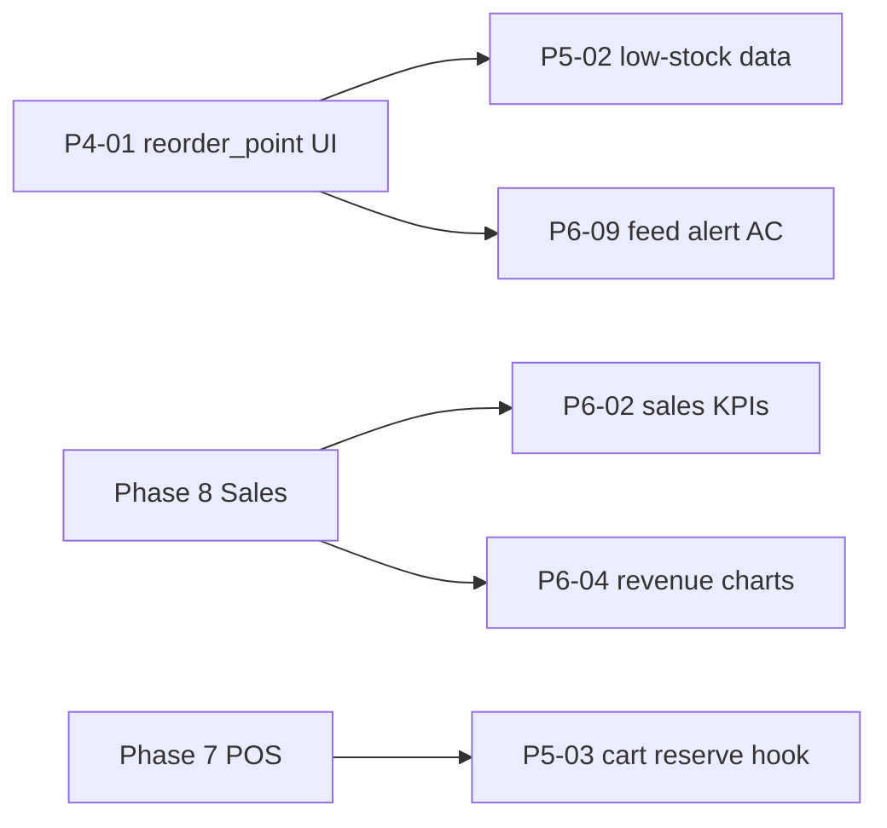

# RetailPulse — Phase Gaps Register

Tracked gaps between **phase specifications** (`docs/phases/`) and the **current codebase**.  
Last reviewed: 2026-05-16.

## Severity legend

| Severity | Meaning |
| :--- | :--- |
| **Critical** | Blocks acceptance criteria or core safety; fix before calling the phase complete. |
| **High** | Important feature or spec item missing; users will notice or workflows break. |
| **Medium** | Partial implementation, polish, or prep for a later phase; should be scheduled. |
| **Low** | Stretch goals, optional items, or verification-only (e.g. Lighthouse). |

---

## Phase 1 — Super Admin, Authentication & RBAC

**Phase doc status:** Mostly complete  
**Overall gap level:** Low (few follow-ups)

| ID | Gap | Severity | Notes |
| :--- | :--- | :---: | :--- |
| P1-01 | **Deactivate vs delete users** — `is_active` exists but `UserController::destroy` / `UserService::delete` still hard-delete users | **High** | Phase doc §14; prefer deactivate-only or explicit delete confirmation in UI. |
| P1-02 | **`users.assign-roles` not enforced server-side** — `UserPolicy::assignRoles` exists but `UserService::create` / `update` call `syncRoles()` without checking permission | **High** | UI may hide roles; API/form can still submit role changes. |
| P1-03 | **`user_permission_overrides`** — migration + model only; no service or user-edit tab | **Medium** | Marked stretch in Phase 1; SRS §3.2 user-specific grants/revokes. |
| P1-04 | Breeze scaffold tests may not match redirect-based auth routes | **Low** | Optional; not a delivery gate per project policy. |

---

## Phase 2 — Platform Shell & Design System

**Phase doc status:** Complete  
**Overall gap level:** Minimal

| ID | Gap | Severity | Notes |
| :--- | :--- | :---: | :--- |
| P2-01 | **Lighthouse accessibility ≥ 90** on admin dashboard not verified in repo | **Low** | Acceptance criterion in phase doc; manual/CI check only. |
| P2-02 | Breeze auth pages may still differ from full shadcn polish vs admin shell | **Low** | Functional; Phase 2 marked complete for shell consistency. |

---

## Phase 3 — Multi-Branch & Centralized Management

**Phase doc status:** Complete  
**Overall gap level:** None significant

| ID | Gap | Severity | Notes |
| :--- | :--- | :---: | :--- |
| P3-01 | No material gaps vs acceptance criteria | — | Branches, warehouses, `SetBranchContext`, switcher, permissions, user assignment implemented. |

---

## Phase 4 — Product Information Management (PIM)

**Phase doc status:** Complete  
**Overall gap level:** Medium (two functional gaps)

| ID | Gap | Severity | Notes |
| :--- | :--- | :---: | :--- |
| P4-01 | **`reorder_point` not editable in product/variant UI** — DB column exists on `product_variants` | **High** | Blocks low-stock alerts (Phase 5/6); operators cannot set thresholds. |
| P4-02 | **Serial capture on stock receive** — `product_serials` + serialized type exist; receive flow has no serial input | **High** | Phase 4: “serial capture on receive (Phase 5)”. |
| P4-03 | **`tax_group_id`** nullable, no tax UI | **Low** | Deferred to Phase 14 per phase doc. |

---

## Phase 5 — Inventory & Warehouse Management

**Phase doc status:** Complete  
**Overall gap level:** Medium

| ID | Gap | Severity | Notes |
| :--- | :--- | :---: | :--- |
| P5-01 | **FEFO/FIFO picking strategy** stored on `branches` but not used in deduction/picking/reservation logic | **Medium** | Config UI exists; behavior not wired in `InventoryService` or repositories. |
| P5-02 | **Low-stock detection depends on `reorder_point`** — see P4-01 | **High** | Count/query logic exists in `DashboardService` / broadcast payload; data entry missing. |
| P5-03 | **Reserve/release on cart hold** — service methods exist; no POS/cart hook | **Low** | Explicitly “hook for Phase 7”; acceptable until POS ships. |
| P5-04 | Stock availability API exists (`POST /api/v1/inventory/check-availability`) | — | **Not a gap** — acceptance criterion met. |

---

## Phase 6 — Dashboard & Real-Time Business Intelligence

**Phase doc status:** Planned (partial implementation in codebase)  
**Overall gap level:** High (largest open surface)

| ID | Gap | Severity | Notes |
| :--- | :--- | :---: | :--- |
| P6-01 | **Phase doc status outdated** — still “Planned”; Reverb, channels, events, activity feed partially delivered | **Low** | Update `phase-06-dashboard-realtime.md` when closing phase. |
| P6-02 | **Sales KPIs missing** — Today’s Sales, Gross Profit, ATV not on dashboard | **Medium** | Phase 8 dependency; doc allows stub/zero until sales exist. |
| P6-03 | **Pending Approvals KPI** not implemented | **Medium** | No approval workflow module yet. |
| P6-04 | **WoW / MoM revenue charts** not implemented | **Medium** | Requires Phase 8 sales data or seeded mock data. |
| P6-05 | **Permissions `dashboard.view` and `dashboard.view-profit`** not in `PermissionSeeder`; dashboard uses `admin.dashboard.view` only | **High** | Spec names differ; profit-sensitive widgets not permission-gated. |
| P6-06 | **Branch filter on all widgets** — partial only | **High** | Live feed requires active branch; super-admin ops KPIs are global; RBAC charts not branch-scoped. |
| P6-07 | **Configurable widget visibility** not implemented | **Medium** | Per-user or per-role dashboard layout not built. |
| P6-08 | **`private-admin.{userId}` channel** authorized in `routes/channels.php` but not subscribed in frontend | **Low** | Branch channel used for feed; admin channel reserved for future. |
| P6-09 | **Low-stock alert in feed &lt; 2s** — depends on Reverb running, `.env` / `VITE_REVERB_*`, and reorder points (P4-01) | **High** | Acceptance criterion; end-to-end not guaranteed without ops config + data. |
| P6-10 | **Reverb local ops** — `composer run dev` includes `reverb:start`; production deployment/WebSocket TLS not documented in phase doc | **Medium** | Infra gap for non-local environments. |

### Phase 6 — Implemented (not gaps)

- `laravel/reverb` installed; `config/broadcasting.php`, `config/reverb.php`
- Broadcasting auth: `web` + `auth` on `/broadcasting/auth`
- Channels: `admin.{userId}`, `branch.{branchId}`
- Events: `InventoryStockChanged`, `UserLoggedIn` (`ShouldBroadcastNow`)
- Echo client + `DashboardRealtimeActivity` component
- Super-admin operations snapshot on dashboard (`DashboardService::superAdminOverview`)

---

## Cross-phase dependencies

---

## Recommended fix order

1. **P4-01** — Reorder point on variant/product form (unblocks P5-02, P6-09).  
2. **P1-02**, **P1-01** — RBAC enforcement and deactivate-only users.  
3. **P6-05**, **P6-06** — Dashboard permissions and branch-scoped widgets.  
4. **P4-02** — Serial capture on receive.  
5. **P6-02–P6-04**, **P6-07** — KPI stubs and charts when Phase 8 is near.  
6. **P5-01** — FEFO/FIFO in inventory logic.

---

## Summary by severity

| Severity | Count (approx.) |
| :--- | :---: |
| Critical | 0 |
| High | 8 |
| Medium | 9 |
| Low | 5 |

*Counts treat P3-01 as no gap; P5-04 and Phase 6 “implemented” rows excluded.*
