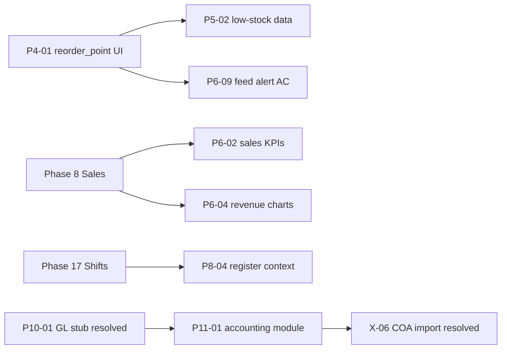

# RetailPulse — Phase Gaps Register

Tracked gaps between **phase specifications** (`docs/phases/`) and the **current codebase**.  
Last reviewed: 2026-07-14 (Phase 11 high-severity sub-module gaps closed; P10-01 / P11-03 marked resolved to match code).

## Severity legend

| Severity | Meaning |
| :--- | :--- |
| **Critical** | Blocks acceptance criteria or core safety; fix before calling the phase complete. |
| **High** | Important feature or spec item missing; users will notice or workflows break. |
| **Medium** | Partial implementation, polish, or prep for a later phase; should be scheduled. |
| **Low** | Stretch goals, optional items, or verification-only (e.g. Lighthouse). |

---

## Phase 1 — Super Admin, Authentication & RBAC

**Phase doc status:** Mostly complete  
**Overall gap level:** Low (few follow-ups)

| ID | Gap | Severity | Notes |
| :--- | :--- | :---: | :--- |
| P1-01 | **Deactivate vs delete users** — `is_active` exists but `UserController::destroy` / `UserService::delete` still hard-delete users | **High** | Phase doc §14; prefer deactivate-only or explicit delete confirmation in UI. |
| P1-02 | **`users.assign-roles` not enforced server-side** — `UserPolicy::assignRoles` exists but `UserService::create` / `update` call `syncRoles()` without checking permission | **High** | UI may hide roles; API/form can still submit role changes. |
| P1-03 | **`user_permission_overrides`** — migration + model only; no service or user-edit tab | **Medium** | Marked stretch in Phase 1; SRS §3.2 user-specific grants/revokes. |
| P1-04 | Breeze scaffold tests may not match redirect-based auth routes | **Low** | Optional; not a delivery gate per project policy. |
| P1-05 | **Supplier payment policy alignment** — `abort_unless` replaced with `SupplierPaymentPolicy` + `authorize()` | — | **Resolved 2026-07-06** |
| P1-06 | **Loyalty API read authorization** — wallet/transactions/campaigns gated by `pos.access` or `loyalty.view` | — | **Resolved 2026-07-06** |
| P1-07 | **Import/export job owner-only access** — `show`/`cancel`/`download` require `user_id` match | — | **Resolved 2026-07-06** |
| P1-08 | **Inventory check-availability route auth** — moved to `web`+`auth`+`pos.access`; FormRequest checks `inventory.view` | — | **Resolved 2026-07-06** |

---

## Phase 2 — Platform Shell & Design System

**Phase doc status:** Complete  
**Overall gap level:** Minimal

| ID | Gap | Severity | Notes |
| :--- | :--- | :---: | :--- |
| P2-01 | **Lighthouse accessibility ≥ 90** on admin dashboard not verified in repo | **Low** | Acceptance criterion in phase doc; manual/CI check only. |
| P2-02 | Breeze auth pages may still differ from full shadcn polish vs admin shell | **Low** | Functional; Phase 2 marked complete for shell consistency. |

---

## Phase 3 — Multi-Branch & Centralized Management

**Phase doc status:** Complete  
**Overall gap level:** None significant

| ID | Gap | Severity | Notes |
| :--- | :--- | :---: | :--- |
| P3-01 | No material gaps vs acceptance criteria | — | Branches, warehouses, `SetBranchContext`, switcher, permissions, user assignment implemented. |
| P3-02 | **`warehouses.type` column + admin UI** — `WarehouseType` enum, DTOs, create/edit/index | — | **Resolved 2026-07-06** |

---

## Phase 4 — Product Information Management (PIM)

**Phase doc status:** Complete  
**Overall gap level:** Medium (two functional gaps)

| ID | Gap | Severity | Notes |
| :--- | :--- | :---: | :--- |
| P4-01 | **`reorder_point` not editable in product/variant UI** — DB column exists on `product_variants` | **High** | Blocks low-stock alerts (Phase 5/6); operators cannot set thresholds. |
| P4-02 | **Serial capture on stock receive** — `product_serials` + serialized type exist; receive flow has no serial input | **High** | Phase 4: “serial capture on receive (Phase 5)”. |
| P4-03 | **`tax_group_id`** nullable, no tax UI | **Low** | Deferred to Phase 14 per phase doc. |

---

## Phase 5 — Inventory & Warehouse Management

**Phase doc status:** Complete  
**Overall gap level:** Medium

| ID | Gap | Severity | Notes |
| :--- | :--- | :---: | :--- |
| P5-01 | **FEFO/FIFO picking strategy** — `allocateDeductionLines` uses branch strategy; FEFO join column ambiguity fixed | — | **Resolved 2026-07-06** (service tests added) |
| P5-02 | **Low-stock detection depends on `reorder_point`** — see P4-01 | **High** | Count/query logic exists in `DashboardService` / broadcast payload; data entry missing. |
| P5-03 | **Reserve/release on cart hold** — wired in `PosCartService` | — | **Resolved** — implemented with Phase 7 POS. |
| P5-04 | Stock availability API exists (`POST /api/v1/inventory/check-availability`) | — | **Not a gap** — acceptance criterion met. |
| P5-05 | **Stock mutation single source of truth** — `BinLocationService` / `QuarantineService` route through `InventoryService` | — | **Resolved 2026-07-06** |

---

## Phase 6 — Dashboard & Real-Time Business Intelligence

**Phase doc status:** Planned (partial implementation in codebase)  
**Overall gap level:** High (largest open surface)

| ID | Gap | Severity | Notes |
| :--- | :--- | :---: | :--- |
| P6-01 | **Phase doc status outdated** — still “Planned”; Reverb, channels, events, activity feed partially delivered | **Low** | Update `phase-06-dashboard-realtime.md` when closing phase. |
| P6-02 | **Sales KPIs missing** — Today’s Sales, Gross Profit, ATV not on dashboard | **Medium** | Phase 8 dependency; doc allows stub/zero until sales exist. |
| P6-03 | **Pending Approvals KPI** not implemented | **Medium** | No approval workflow module yet. |
| P6-04 | **WoW / MoM revenue charts** not implemented | **Medium** | Requires Phase 8 sales data or seeded mock data. |
| P6-05 | **Permissions `dashboard.view` and `dashboard.view-profit`** not in `PermissionSeeder`; dashboard uses `admin.dashboard.view` only | **High** | Spec names differ; profit-sensitive widgets not permission-gated. |
| P6-06 | **Branch filter on all widgets** — partial only | **High** | Live feed requires active branch; super-admin ops KPIs are global; RBAC charts not branch-scoped. |
| P6-07 | **Configurable widget visibility** not implemented | **Medium** | Per-user or per-role dashboard layout not built. |
| P6-08 | **`private-admin.{userId}` channel** authorized in `routes/channels.php` but not subscribed in frontend | **Low** | Branch channel used for feed; admin channel reserved for future. |
| P6-09 | **Low-stock alert in feed &lt; 2s** — depends on Reverb running, `.env` / `VITE_REVERB_*`, and reorder points (P4-01) | **High** | Acceptance criterion; end-to-end not guaranteed without ops config + data. |
| P6-10 | **Reverb local ops** — `composer run dev` includes `reverb:start`; production deployment/WebSocket TLS not documented in phase doc | **Medium** | Infra gap for non-local environments. |

### Phase 6 — Implemented (not gaps)

- `laravel/reverb` installed; `config/broadcasting.php`, `config/reverb.php`
- Broadcasting auth: `web` + `auth` on `/broadcasting/auth`
- Channels: `admin.{userId}`, `branch.{branchId}`
- Events: `InventoryStockChanged`, `UserLoggedIn` (`ShouldBroadcastNow`)
- Echo client + `DashboardRealtimeActivity` component
- Super-admin operations snapshot on dashboard (`DashboardService::superAdminOverview`)

---

## Phase 7 — Point of Sale

**Phase doc status:** Planned (substantial implementation in codebase)  
**Overall gap level:** Medium

| ID | Gap | Severity | Notes |
| :--- | :--- | :---: | :--- |
| P7-01 | **`pos_discount_logs` audit table** — discounts validated server-side but not logged with approval chain | **Medium** | Phase doc §discount approval. |
| P7-02 | **Manager PIN for large discounts** — API supports `approved` flag; POS UI does not collect approver PIN | **High** | `DiscountModal` passes null approver. |
| P7-03 | **`pos.override-stock` not wired** — permission seeded; no override flow on OOS warnings | **High** | Blocks override AC when stock warnings shown. |
| P7-04 | **Offline mode incomplete** — `pos-sw.js` + IndexedDB skeleton; fetch interception disabled | **Medium** | Stretch AC in phase doc. |
| P7-05 | **Customer credit WebSocket banner on POS** — `CustomerCreditLimitWarning` event exists; POS does not subscribe | **Low** | Cross-phase with P9-02. |

### Phase 7 — Implemented (not gaps)

- POS SPA (`resources/js/Pages/POS/Index.jsx`), keyboard shortcuts, F10 checkout handoff
- Cart CRUD, suspend/resume, void, stock warnings, `PosCartService` reservations
- PIN verify/set/lockout (`PosPinService`)
- Product search/catalog APIs behind `pos.access`

---

## Phase 8 — Checkout, Payments & Invoicing

**Phase doc status:** ~95% complete  
**Overall gap level:** Medium

| ID | Gap | Severity | Notes |
| :--- | :--- | :---: | :--- |
| P8-01 | **Live payment gateway HTTP drivers** — `SalePaymentProcessor` stub/disabled only | **High** | Stripe/JazzCash/EasyPaisa not integrated. |
| P8-02 | **Layaway overdue surfacing** — `max_layaway_balance_days` setting; no overdue UI alerts | **Medium** | |
| P8-03 | **Historical sales dashboard toggle** — KPIs exclude `is_historical`; no UI to include | **Medium** | AC #6 in phase doc. |
| P8-04 | **Shift/register context (Phase 17)** — checkout has no register/shift binding | **High** | Blocks production go-live per SRS. |
| P8-05 | **Gift card tender + COGS on complete** — deferred; `SaleCompleted` triggers loyalty only | **Medium** | Cross-phase 24 / 11. |

### Phase 8 — Implemented (not gaps)

- Checkout lifecycle, split tender, layaway, tax pipeline, invoice PDF, FBR queue/block modes
- Historical sale import API (`POST /api/v1/sales/import-historical`)
- Configuration via `system_settings` groups (`tax`, `checkout`, `fbr`)

---

## Phase 9 — Customers & Loyalty

**Phase doc status:** Complete  
**Overall gap level:** Low–Medium

| ID | Gap | Severity | Notes |
| :--- | :--- | :---: | :--- |
| P9-01 | **Customer group → price list at POS** — groups CRUD exists; auto pricing is Phase 18 | **Medium** | |
| P9-02 | **POS credit-limit WebSocket warning** — event broadcast; POS screen does not consume | **Medium** | See P7-05. |
| P9-03 | **Gift card lookup at checkout** | **Low** | Explicitly Phase 24. |
| P9-04 | **AR polish** — aging/statements exist; SMS/WhatsApp delivery unverified | **Low** | |

### Phase 9 — Implemented (not gaps)

- Customer CRUD, credit limits, wallet top-up, loyalty programs/tiers/campaigns
- `CustomerImportHandler`, loyalty earn on sale complete, redemption APIs

---

## Phase 10 — Suppliers & Procurement

**Phase doc status:** Core complete  
**Overall gap level:** Medium

| ID | Gap | Severity | Notes |
| :--- | :--- | :---: | :--- |
| P10-01 | **GL / FIFO cost layers stubbed** — `NullProcurementPostingHook` for landed cost, returns, payments | — | **Resolved** — `ProcurementAccountingHook` is bound in `AppServiceProvider`; procurement path posts via accounting events. `NullProcurementPostingHook` remains in tree unused. |
| P10-02 | **Historical PO bulk import** — `is_historical` column; no import handler | **Medium** | |
| P10-03 | **Procurement alert delivery** — DB alerts only; email/SMS deferred Phase 14 | **Medium** | |
| P10-04 | **Procurement report export queue** — in-app reports only | **Low** | |
| P10-05 | **Drop-ship customer invoice** — virtual GRN stub; no customer invoice generation | **Medium** | |

### Phase 10 — Implemented (not gaps)

- PO → approval → GRN → supplier invoice → payment workflow
- `SupplierImportHandler`, match exceptions, purchase returns, landed cost entries

---

## Phase 11 — Accounting & Finance

**Phase doc status:** Substantially built  
**Overall gap level:** Low–Medium — core GL and High sub-module UI/report surfaces are in place; Intercompany product and residual Medium/Low depth remain

| ID | Gap | Severity | Notes |
| :--- | :--- | :---: | :--- |
| P11-01 | **Double-entry GL stack** — COA, journals, posting rules | — | **Resolved** — `chart_of_accounts`, `journal_entries`, `journal_transactions`, `posting_rule_sets`/`posting_rule_lines` migrations and services exist (`JournalService`, `PostingRuleEngine`, `AccountResolverService`). |
| P11-02 | **Auto-post on sale complete** — `SaleCompleted` has loyalty listener only | — | **Resolved** — `ProcessAccountingOnSaleCompleted` listener registered in `AppServiceProvider`, routes through `AccountingEventService`. |
| P11-03 | **`inventory_cost_layers` + COGS** | — | **Resolved** — `inventory_cost_layers` + `CostService` (FIFO/WAC), sale COGS consumption, GRN layer create, Create Cost Layer admin. Residual Medium items (LIFO report-only, scoped valuation, inventory movement report) are not tracked as this ID. |
| P11-04 | **Financial statements** (Trial Balance, P&L, Balance Sheet) | — | **Resolved** — `FinancialReportingService` + `AccountingReportController` implement all core reports. |
| P11-05 | **COA / opening balance import (X-06)** | — | **Resolved** — `CoaImportService`, `OpeningBalanceImportService`. |
| P11-06 | **Float-equality bug in journal balance validation** — `JournalValidationService::assertCanPost()` compared debit/credit totals via `round((float)$a,2) !== round((float)$b,2)` | — | **Resolved 2026-07-08** — replaced with `bccomp()` on decimal strings (never cast through float); regression test covers the classic `0.10+0.10+0.10` vs `0.30` float-imprecision trap. |
| P11-07 | **Same float-equality bug in fiscal-year-close validation** — `FiscalCloseService::validate()` had the identical anti-pattern | — | **Resolved 2026-07-08** — same `bccomp()` fix applied. |
| P11-08 | **Uncaught race in `AccountingEventService::process()`** — two concurrent calls with the same idempotency key could both pass the initial existence check and the second `create()` would throw an uncaught `UniqueConstraintViolationException` instead of reusing the existing event | — | **Resolved 2026-07-08** — `create()` now runs through a helper that catches the violation and re-fetches the existing row. |
| P11-09 | **`PostingRuleEngine` silently dropped required lines that resolved to a zero amount** — a required line (e.g. a mandatory tax line) resolving to `<= 0` was skipped exactly like an optional line, inconsistent with the null-account case which correctly threw | — | **Resolved 2026-07-08** — a required line resolving to `<= 0` now throws `DomainException`, matching the null-account behavior. Found during the Phase 1 audit, same class of bug as P11-06/07/08. |
| P11-10 | **`AccountResolverService::resolveByMappingKey()` called `CarbonInterface::parse()`** — an abstract interface method that cannot be invoked statically. Since `PostingRuleEngine` always passes a `date` context key, this broke every non-`FixedAccount` resolution type (`AccountMapping`/`ConfigurableMapping`, `CustomerReceivableAccount`, `SupplierPayableAccount`, `PaymentMethodAccount`, `WarehouseInventoryAccount`, `TaxAccount`) in production | — | **Critical, Resolved 2026-07-08** — fixed by importing `Carbon` instead. Found while writing Phase 2 test coverage, not one of the originally-scoped bugs; fixed rather than deferred because it silently broke most of the posting-rule engine and blocked the requested tests outright. |
| P11-11 | **Missing `asset_account` resolution type** — spec lists 13 resolution types; only 10 existed | — | **Resolved 2026-07-08** — `AccountResolutionType::AssetAccount` added; `PostingRuleEngine::resolveAccount()` resolves per-asset or per-category account columns via a repurposed `account_mapping_key` acting as a role selector (`asset_account`/`accumulated_depreciation_account`/`depreciation_expense_account`). `employee_payable_account` (no payroll module — Phase 12) and `intercompany_account` (config-gated behind `multi_currency`, deferred) remain **deliberately absent**, documented via a doc-comment on the enum, not an oversight. |
| P11-12 | **FX Revaluation was a read-only stub** — `AccountingReportController::fxRevaluation()` only listed already-booked foreign-currency lines at their booked rate; no unrealized gain/loss calculation or posting existed despite `fx_gain_account_id`/`fx_loss_account_id` already being configurable in `financial_settings` | — | **Resolved 2026-07-08** — new `FxRevaluationService::revalue()` computes unrealized gain/loss on open foreign-currency balance-sheet accounts (Asset/Liability only) at a period-end rate, posts one journal entry tagged `source_event = fx_revaluation`, and immediately posts an offsetting reversal dated the day after (standard unrealized-FX practice; no fiscal-periods table exists to hang a scheduled reversal off of). Guards against double-revaluation for the same as-of date. |
| P11-13 | **Sub-module decomposition (interim gate)** — accounting was monolithic; every sub-module (Cost Centres, Tax, Multi-Currency, Bank Reconciliation, Petty Cash, Cheques, Fixed Assets, Credit/Debit Notes) was reachable by any tenant with accounting enabled at all, but the business wants to sell these independently | — | **Resolved 2026-07-08** — `config/accounting_modules.php` (dependency graph) + `AccountingModuleGate` interface / `BranchAccountingModuleGate` implementation (branch-scoped, extends the existing `branch_accounting_profiles` table rather than a new one) + `EnsureAccountingModuleEnabled` middleware gate the relevant route groups, plus a new `enabledAccountingModules` Inertia prop drives nav visibility. **Admin UI added 2026-07-14** — Accounting → Accounting Modules writes `BranchAccountingProfile.accounting_enabled_modules` per branch (`accounting.manage-modules`). **Explicitly an interim mechanism** pending the full Module Registry (`modules`/`module_features`/`tenant_modules`/`CheckModuleEnabled`) planned for **Phase 23** (see `docs/phases/phase-23-module-config-engine.md`) — swapping in the real registry should only require replacing the `AccountingModuleGate` binding in `AppServiceProvider`, not touching controllers/routes/nav. |
| P11-14 | **Zero test coverage on the accounting module** despite being the most correctness-critical part of the app | — | **Resolved 2026-07-08** — 113+ tests under `tests/Feature/Accounting/` covering `JournalValidationService`, `PostingRuleEngine` (all resolution types + all amount sources), `AccountResolverService`, `AccountingEventService`, `JournalService`, `FiscalCloseService`, `JournalEntryPolicy` (first policy-authorization tests in this codebase — 34 policy classes existed with none tested), the accounting module gate (unit + HTTP-level route gating), `FxRevaluationService`, fiscal reopen, tax posting, opening-balance import, and event pipeline integration. |
| P11-15 | **`BankAccount`/`ProductCategoryAccount` resolution types fall through to `FixedAccount` behavior** — `PostingRuleEngine::resolveAccount()`'s `default` arm silently catches both enum cases, so no bank- or category-specific resolution logic actually exists despite the cases existing | — | **Resolved 2026-07-08** — `PostingRuleEngine` now implements `resolveBankAccount()` (from `bank_account_id` in payload or `bank_account` mapping) and `resolveProductCategoryAccount()` (category-scoped mapping). Regression test updated from fallthrough documentation to resolution behavior. |
| P11-16 | **Duplicate unique constraints on `accounting_events`** — both `idempotency_key` (unique) and the composite `(event_type, source_type, source_id)` encode the same uniqueness rule | **Low** | Redundant, not incorrect. A future migration could drop one without a behavior change. |
| P11-17 | **`AccountingEventService` can leave an event stuck in `Processing`** — status flips to `Processing` before the posting transaction runs; if the process crashes after a successful post but before the final `Completed` update, the event row never reflects success, and `retry()` only re-processes from `Failed` so it silently no-ops | — | **Resolved 2026-07-08** — `recoverStaleProcessing()` runs at the start of `process()` and `retry()`; uses `config('accounting.processing_stale_after_seconds', 300)`. If stale and a journal is already linked, auto-completes; otherwise marks `Failed` so retry works. `Completed` update is inside the same DB transaction as `post()` where possible. |
| P11-18 | **`JournalService::reverse()` reuses the original entry's `fiscal_year_id`** instead of resolving the fiscal year for the new reversal date | — | **Resolved 2026-07-08** — reversal draft no longer copies `fiscal_year_id`; `createDraft()` resolves FY from `journal_date` via `resolveFiscalYearId()`. |
| P11-19 | **Account Mapping UI missing scope fields** — warehouse, category, payment method, currency, legal entity, effective dates | — | **Resolved 2026-07-14** — Account Mappings modal + option props; Store/Update empty-string → null prep. |
| P11-20 | **Petty cash vouchers** — create/approve/reject routes and UI | — | **Resolved 2026-07-14** — voucher store/approve/reject; `accounting.approve-petty-cash`; `PettyCashVoucherPolicy`; Index create + approve/reject. |
| P11-21 | **Fixed asset dispose + run depreciation UI** | — | **Resolved 2026-07-14** — dispose + run-depreciation routes/actions on Fixed Assets Index. |
| P11-22 | **Tax Return report** | — | **Resolved 2026-07-14** — `FinancialReportingService::taxReturn()` + report card; Show page fiscal-year filter. |
| P11-23 | **Bank reconciliation multi-match / partial status** | — | **Resolved 2026-07-14** — `BankStatementLineStatus::PartiallyMatched`; multi-transaction match; remaining amounts in UI. |
| P11-24 | **Draft journal edit/delete** | — | **Resolved 2026-07-14** — `JournalService::deleteDraft`; edit/update/destroy routes; `JournalEntries/Edit.jsx`; Index/Show draft actions. |
| P11-25 | **Cost Centre Allocations** — shared expense allocation workflow | **Medium** | **Schema only** — `CostCentreAllocation` model + `CostCentreAllocationMethod` enum/migration. No service, controller, route, or UI for allocation runs. Cost Centre CRUD + Cost Centre P&L are separate and working. |
| P11-26 | **Intercompany product surface** — transfers / settlement / balance report | **High** | Deliberately deferred — module gate + tables exist; no admin routes/UI; `intercompany_account` resolution type absent by design (enum doc-comment). |

---

## Phase 12 — Expenses & HR / Payroll

**Phase doc status:** Planned  
**Overall gap level:** High (module not started)

| ID | Gap | Severity | Notes |
| :--- | :--- | :---: | :--- |
| P12-01 | **Expense module** (entry, categories, recurring scheduler) | **High** | |
| P12-02 | **HR / payroll module** | **High** | |
| P12-03 | **POS clock-in/out via cashier PIN** | **Medium** | |
| P12-04 | **Leave/overtime/payslip (v4.0 stretch)** | **Low** | |

---

## Phase 13 — Reporting & Analytics

**Phase doc status:** Planned  
**Overall gap level:** High (platform not built)

| ID | Gap | Severity | Notes |
| :--- | :--- | :---: | :--- |
| P13-01 | **Built-in reports** — inventory valuation, cashier performance, sales-by-branch | **High** | Domain reports exist (procurement, loyalty); not full suite. |
| P13-02 | **Dynamic report builder + saved definitions** | **High** | |
| P13-03 | **Queued Excel/PDF export (X-07)** | **Medium** | |
| P13-04 | **Data mart ETL** (`data_mart_sales`, scheduled aggregation) | **Medium** | |

---

## Phase 14 — Notifications, Returns & Tax Engine

**Phase doc status:** Planned  
**Overall gap level:** Critical (customer returns missing)

| ID | Gap | Severity | Notes |
| :--- | :--- | :---: | :--- |
| P14-01 | **Customer return/refund workflow** | **Critical** | Purchase returns exist (Phase 10); not customer returns. |
| P14-02 | **Composite tax engine** (`tax_groups`, inclusive flags) | **High** | Checkout uses flat `TaxCalculationService` only. |
| P14-03 | **Notification preferences + admin broadcast** | **High** | |
| P14-04 | **Fraud controls** (price override logs, void logs) | **Medium** | |
| P14-05 | **Alert delivery** (email/SMS for low-stock, procurement) | **Medium** | |

---

## Cross-cutting — Data import, export & onboarding (SRS §3.18)

**Status:** Framework **implemented** 2026-06+; partial gaps remain.

| ID | Gap | Severity | Target phase |
| :--- | :--- | :---: | :--- |
| X-01 | Bulk product import/export | — | **Resolved** — `ProductImportHandler` / `ProductExportHandler` + catalog entities. |
| X-02 | Opening stock import | — | **Resolved** — `InventoryImportHandler`, `inventory-adjustments`. |
| X-03 | Shared `import_export_jobs` framework | — | **Resolved** — wizard, queued jobs, `ImportExportRegistry`. |
| X-04 | Historical sales archive import | **Medium** | Phase 8 — dedicated API exists; not in generic import registry. |
| X-05 | Customer/supplier bulk import | — | **Resolved** — `CustomerImportHandler`, `SupplierImportHandler`. |
| X-06 | COA / opening balance import | — | **Resolved** — see P11-05. |
| X-07 | Report Excel/PDF export queue | **Medium** | Phase 13 |
| X-08 | Import/export API endpoints | **Low** | Partial — admin session routes exist; Phase 15 external API TBD. |

**Onboarding critical path (new retailer):** Product import → opening stock → POS go-live (Phase 7) → optional historical sales for charts.

---

## Cross-phase dependencies

---

## Recommended fix order

1. **P4-01** — Reorder point on variant/product form (unblocks P5-02, P6-09).  
2. **P1-02**, **P1-01** — RBAC enforcement and deactivate-only users.  
3. **P8-04** / Phase 17 — Shift/register before production checkout.  
4. **P7-02**, **P7-03** — Discount approval PIN and stock override.  
5. **P6-05**, **P6-06** — Dashboard permissions and branch-scoped widgets.  
6. **P11-26** — Intercompany product surface (deferred by design until multi-entity ops need it); **P11-25** Cost Centre Allocations workflow.  
7. **P14-01** — Customer returns workflow.  
8. **P4-02** — Serial capture on receive.  
9. **P8-01** — Live payment gateways when required.

---

## Summary by severity

| Severity | Count (approx.) |
| :--- | :---: |
| Critical | 1 |
| High | 21 |
| Medium | 23 |
| Low | 12 |

*Counts exclude resolved rows (including P10-01, P11-01–P11-15, P11-17–P11-24, X-01–X-03/X-05–X-06) and “not a gap” / implemented subsections. High count still driven by earlier phases (P1/P4/P7/P8/P12/P13/P14) plus P11-26 Intercompany.*
