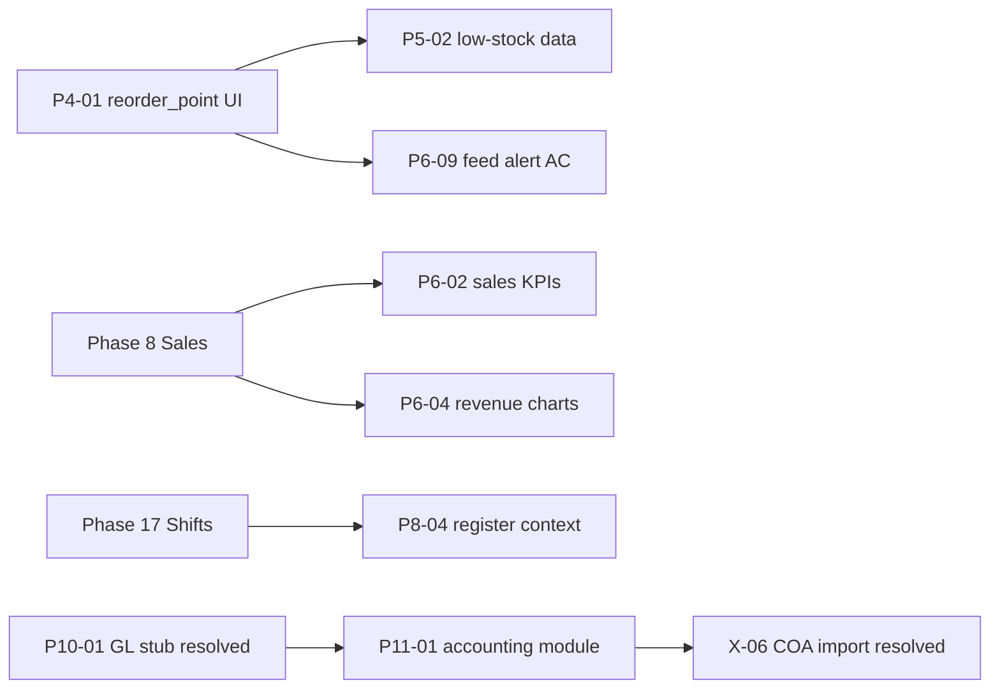

# RetailPulse — Phase Gaps Register

Tracked gaps between **phase specifications** (`docs/phases/`) and the **current codebase**.  
Last reviewed: 2026-07-22 (Phase 3: P3-03 cross-branch data access documented; HR Employees `BranchContext` enforcement closed. Phase 11 correctness bugs P11-27–P11-31 closed 2026-07-14; P11-16/P11-25 resolved; P11-26 Intercompany remains open).

## Severity legend

| Severity | Meaning |
| :--- | :--- |
| **Critical** | Blocks acceptance criteria or core safety; fix before calling the phase complete. |
| **High** | Important feature or spec item missing; users will notice or workflows break. |
| **Medium** | Partial implementation, polish, or prep for a later phase; should be scheduled. |
| **Low** | Stretch goals, optional items, or verification-only (e.g. Lighthouse). |

---

## Phase 1 — Super Admin, Authentication & RBAC

**Phase doc status:** Mostly complete  
**Overall gap level:** Low (few follow-ups)

| ID | Gap | Severity | Notes |
| :--- | :--- | :---: | :--- |
| P1-01 | **Deactivate vs delete users** — `is_active` exists but `UserController::destroy` / `UserService::delete` still hard-delete users | **High** | Phase doc §14; prefer deactivate-only or explicit delete confirmation in UI. |
| P1-02 | **`users.assign-roles` not enforced server-side** — `UserPolicy::assignRoles` exists but `UserService::create` / `update` call `syncRoles()` without checking permission | **High** | UI may hide roles; API/form can still submit role changes. |
| P1-03 | **`user_permission_overrides`** — migration + model only; no service or user-edit tab | **Medium** | Marked stretch in Phase 1; SRS §3.2 user-specific grants/revokes. |
| P1-04 | Breeze scaffold tests may not match redirect-based auth routes | **Low** | Optional; not a delivery gate per project policy. |
| P1-05 | **Supplier payment policy alignment** — `abort_unless` replaced with `SupplierPaymentPolicy` + `authorize()` | — | **Resolved 2026-07-06** |
| P1-06 | **Loyalty API read authorization** — wallet/transactions/campaigns gated by `pos.access` or `loyalty.view` | — | **Resolved 2026-07-06** |
| P1-07 | **Import/export job owner-only access** — `show`/`cancel`/`download` require `user_id` match | — | **Resolved 2026-07-06** |
| P1-08 | **Inventory check-availability route auth** — moved to `web`+`auth`+`pos.access`; FormRequest checks `inventory.view` | — | **Resolved 2026-07-06** |

---

## Phase 2 — Platform Shell & Design System

**Phase doc status:** Complete  
**Overall gap level:** Minimal

| ID | Gap | Severity | Notes |
| :--- | :--- | :---: | :--- |
| P2-01 | **Lighthouse accessibility ≥ 90** on admin dashboard not verified in repo | **Low** | Acceptance criterion in phase doc; manual/CI check only. |
| P2-02 | Breeze auth pages may still differ from full shadcn polish vs admin shell | **Low** | Functional; Phase 2 marked complete for shell consistency. |

---

## Phase 3 — Multi-Branch & Centralized Management

**Phase doc status:** Complete  
**Overall gap level:** Medium — core branch-assignment/switching mechanics are solid; cross-branch data-access model and consistent enforcement are gaps (see P3-03)  
**Last reviewed:** 2026-07-22

| ID | Gap | Severity | Notes |
| :--- | :--- | :---: | :--- |
| P3-01 | No material gaps vs the Phase 3 acceptance criteria as originally scoped | — | Branches, warehouses, `SetBranchContext`, switcher, permissions, user assignment implemented. Superseded for anything beyond the original AC by P3-03: acceptance criteria didn't anticipate an intermediate cross-branch/regional visibility tier, and didn't test whether every module actually applies `BranchContext`. |
| P3-02 | **`warehouses.type` column + admin UI** — `WarehouseType` enum, DTOs, create/edit/index | — | **Resolved 2026-07-06** |
| P3-03 | **Cross-branch data access & regional visibility** — no intermediate capability model; inconsistent `BranchContext` enforcement across modules | **Medium** | See detail below. Nine **High**-severity confirmed leaks were **closed 2026-07-22** across HR Employees, HR Holiday Calendars, HR Attendance Records, and the full Leave/Overtime/TOIL surface (Leave Requests, Leave Entitlements, Leave Encashments, Leave Year-End Runs, Overtime Records, Overtime Policies, TOIL Cash Claims) — several were write-path gaps (approve/reject/record actions), not just display leaks. The Medium-severity capability-model gap remains open, as does enforcement in Payroll runs, most Accounting lists, and Procurement/Inventory partial-scoping. |

### P3-03 detail — Cross-Branch Data Access & Regional Visibility

The current `BranchContext` (`app/Support/BranchContext.php`, `BranchContextService::accessibleBranchIds()`) supports two states only: branch-restricted (a `list<int>` of assigned branches) or fully unrestricted (`null` = every branch, head-office style). It lacks an intermediate **cross-branch** tier. Future releases should introduce explicit permissions — `branches.view-own`, `branches.view-cross`, `branches.view-all`, `branches.switch` — to support regional managers, head-office HR/finance, auditors, and other corporate roles that need visibility across multiple *assigned* branches without granting silent company-wide access. Queries and policies must consistently respect the user's **effective** branch set while allowing optional filtering between an individual branch and all allowed branches.

**Near-term enforcement gap (independent of the permission model above):** many modules ignore `BranchContext` entirely today, so even the existing two-tier model (restricted vs. unrestricted) isn't applied consistently:

| Area | Status (as of 2026-07-22) |
| :--- | :--- |
| HR Employees / Org Chart | **Resolved this pass** — `EmployeeService::paginate`/`formOptions`, `EmployeePolicy`, `OrgChartController`/`ReportingHierarchyService::orgChart`, `EmployeeImportHandler`/`EmployeeExportHandler` now apply the accessible-branch set via `BranchScope`. |
| HR Holiday Calendars | **Resolved this pass** — found via manual QA while reviewing the Employees fix: the calendar Show page's employee picker (`HolidayCalendarService::showPayload`) queried every active employee company-wide, and the assignment list rendered any employee-type assignment's name regardless of the assignee's branch (a restricted branch-manager could see e.g. `Amina Khan (Employee)` on another branch's calendar). Fixed: `HolidayCalendarPolicy::view`/`update` now check the calendar's own `branch_id` (null = company-wide, unaffected); `showPayload`'s employee picker and branch pickers are scoped; out-of-scope employee-type assignments are filtered out of the `assignments` list entirely (not just unlabeled); `HolidayCalendarRepository::paginate` scopes the calendar list itself to the viewer's branches plus company-wide (`branch_id IS NULL`) calendars. **Not covered:** `storeAssignment` doesn't validate that the *employee being assigned* is in the calendar's/actor's accessible branches — low risk today since `holiday.manage` is only granted to `hr-manager`, which is expected to be company-wide, but worth tightening if that role is ever branch-restricted. |
| HR Attendance Records | **Resolved this pass** — found via manual QA (Manual Clock create form showed every branch's employees and all branches to a restricted branch-manager). This one was a genuine write-path gap, not just a display leak: `AttendanceRecordController::index()` had **no branch filter at all** (any restricted user could list every branch's clock-in/out records), the Manual Clock `create()` pickers were unscoped, and `StoreManualAttendanceRequest` only checked that `employee_id`/`branch_id` *existed*, not that they were in the actor's accessible branches — so a branch-manager could actually record attendance for an out-of-scope employee at an out-of-scope branch, not just see one in a dropdown. Fixed: `index()` scoped via `BranchScope::apply(..., app(BranchContext::class), 'branch_id')`; `create()` pickers scoped to accessible branches; `StoreManualAttendanceRequest::withValidator()` rejects an out-of-scope `branch_id` or an `employee_id` whose `primary_branch_id` is out of scope; `AttendanceRecordPolicy::view`/`adjust` gained the same branch check for when those methods get wired to a route (currently unused — no `show`/`adjust` route exists yet). |
| Leave Requests / Entitlements / Encashments / Year-End Runs | **Resolved this pass** — found via user report, confirmed identical pattern to Attendance. All four had unscoped index queries and unscoped employee pickers; `LeaveEntitlementController`'s `store` FormRequest had `authorize()` hardcoded to `true` with no checks at all. Worse, every `approve`/`reject`/`reschedule`/`cancel` action (`LeaveRequestPolicy`, `LeaveEncashmentPolicy`) was permission-only — a line-manager could approve/reject another branch's employee's leave request or encashment, the same write-path class of bug as Attendance. Fixed: index queries scoped via new `BranchScope::applyViaEmployee()` (added this pass — these models reach branch only through `employee.primary_branch_id`, not an own `branch_id` column); employee pickers scoped; all four Policies gained a branch check on `view`/`approve`/`reject`/`reschedule`/`cancel`/`update`; `StoreLeaveRequestRequest`, `StoreLeaveEntitlementRequest`, `StoreLeaveEncashmentRequest` reject an `employee_id` outside the actor's accessible branches. Leave Types/Leave Policies are unaffected — confirmed legitimately company-wide master data, not employee/branch-scoped. |
| Overtime Records / Overtime Policies / TOIL Cash Claims | **Resolved this pass** — same pattern. `OvertimeRecordController::index()` and `ToilCashClaimController::index()` were unscoped; `ToilCashClaimController::create()`'s employee picker was unscoped; `OvertimeRecordPolicy`/`ToilClaimPolicy`'s `approve`/`reject`/`cancel` were permission-only (same approve-across-branches write-path bug). `OvertimePolicy` is a genuine branch-scoped config model (own nullable `branch_id`, null = entity-wide) that was fully unscoped in both its list query and branch picker. Fixed with the same `BranchScope::applyViaEmployee()` pattern for records/claims, and the `whereNull('branch_id')->orWhereIn(...)` pattern (matching Holiday Calendars) for `OvertimePolicy`. `StoreToilCashClaimRequest` gained the same `employee_id` accessibility check. `overtime.manage-policies` (create/update policy config) is HR-manager-only today, not branch-restricted in practice, so no FormRequest change was made there — documented, not fixed, consistent with the Holiday Calendar `holiday.manage` precedent. |
| Payroll runs | **Not enforced** — documented here; not fixed this pass. |
| Accounting ops (journals, bank, petty cash, cheques, CN/DN, cost centres, assets, expenses) | **Not enforced** — most list endpoints have no branch filter at all. |
| Procurement / Inventory | **Partial** — usually filter by the single active `branchId` only, not the full accessible set; acceptable for `view-own`-shaped restricted users today, but fragile once cross-branch visibility exists. |
| Sales list, Warehouses (+policy), Users list, Dashboard, Search | **Enforced** (gold standard — `SaleController::index`, `WarehouseController`/`WarehousePolicy`, `UserController::userBranchFilterIds`, `DashboardComposer`, `AbstractSearchProvider::scopeBranch`). |
| Policies generally | Now check branch ownership: `WarehousePolicy`, `EmployeePolicy`, `HolidayCalendarPolicy`, `AttendanceRecordPolicy`, `LeaveRequestPolicy`, `LeaveEntitlementPolicy`, `LeaveEncashmentPolicy`, `LeaveYearEndRunPolicy`, `OvertimeRecordPolicy`, `OvertimePolicyPolicy`, `ToilClaimPolicy`. Every other branch-owned model's `show`/`update` route remains a potential IDOR-by-URL if the model has no policy branch check (e.g. `Sale`, `PurchaseOrder`, Payroll, Accounting). |

Evolve `branches.access-all` into `branches.view-all` once the permission model above ships; don't rename it speculatively before then. Also stop treating "no branch assignment" as unrestricted (`BranchContextService::accessibleBranchIds()` returns `null` for both `branches.access-all` *and* `!hasBranchRestrictions()`) — that's a footgun default, not a deliberate grant; it should require an explicit company-wide permission once the new tier exists. Not changed in this pass (documented per the task's "don't change this without an explicit safe assert" guidance).

Branch restriction (assignment) and cross-branch visibility (permission) must be separate concepts. Filtering (active/selected branch) must be separate from authorization (effective allowed set). This is exactly the distinction `App\Support\BranchScope` (added this pass) is built to carry forward: it takes an active branch id (filter) and an accessible-branch list (authorization) as two independent inputs, and is designed for reuse by the modules above rather than each one re-deriving the same `when($branchId...)->when($accessibleIds...)` chain (previously duplicated between `SaleController` and `AbstractSearchProvider::scopeBranch`).

**Target permission model** (documented; not shipped — see acceptance-criteria note above):

| Permission | Purpose |
| :--- | :--- |
| `branches.view-own` | View only assigned branch data (default for branch-scoped roles) |
| `branches.view-cross` | View all *assigned* branches simultaneously / aggregate |
| `branches.view-all` | View every branch in the company (evolves/replaces `branches.access-all`) |
| `branches.switch` | Change active branch in the selector |

`branches.view|create|update|delete` remain branch **master-data** CRUD permissions — orthogonal to data-visibility scope and unaffected by this proposal.

Example role matrix:

| User | Assignments | Permission | Result |
| :--- | :--- | :--- | :--- |
| Branch Manager | Lahore | own | Only Lahore |
| Regional Manager | Lahore, Islamabad, Faisalabad | cross | Those three (individually or aggregated) |
| HR Head / CFO / Auditor | — | all | Entire company |
| Area Sales Manager | North-region branches | cross | Only those assigned |

Target backend contract:

```
Authorization → effectiveBranchIds: null | list<int>
Session/UI filter → selected ⊆ effective
Every query → BranchScope::apply(...) / BranchScope::applyAccessible(...)
Every branch-owned Policy → canAccessBranch / BranchScope::canAccess(...)
```

Cross-reference: Phase 12's `P12-08` Enterprise HRMS expansion and any future branch-scoped headcount/payroll report inherit this same effective-branch-set contract once built.

---

## Phase 4 — Product Information Management (PIM)

**Phase doc status:** Complete  
**Overall gap level:** Medium (two functional gaps)

| ID | Gap | Severity | Notes |
| :--- | :--- | :---: | :--- |
| P4-01 | **`reorder_point` not editable in product/variant UI** — DB column exists on `product_variants` | **High** | Blocks low-stock alerts (Phase 5/6); operators cannot set thresholds. |
| P4-02 | **Serial capture on stock receive** — `product_serials` + serialized type exist; receive flow has no serial input | **High** | Phase 4: “serial capture on receive (Phase 5)”. |
| P4-03 | **`tax_group_id`** nullable, no tax UI | **Low** | Deferred to Phase 14 per phase doc. |

---

## Phase 5 — Inventory & Warehouse Management

**Phase doc status:** Complete  
**Overall gap level:** Medium

| ID | Gap | Severity | Notes |
| :--- | :--- | :---: | :--- |
| P5-01 | **FEFO/FIFO picking strategy** — `allocateDeductionLines` uses branch strategy; FEFO join column ambiguity fixed | — | **Resolved 2026-07-06** (service tests added) |
| P5-02 | **Low-stock detection depends on `reorder_point`** — see P4-01 | **High** | Count/query logic exists in `DashboardService` / broadcast payload; data entry missing. |
| P5-03 | **Reserve/release on cart hold** — wired in `PosCartService` | — | **Resolved** — implemented with Phase 7 POS. |
| P5-04 | Stock availability API exists (`POST /api/v1/inventory/check-availability`) | — | **Not a gap** — acceptance criterion met. |
| P5-05 | **Stock mutation single source of truth** — `BinLocationService` / `QuarantineService` route through `InventoryService` | — | **Resolved 2026-07-06** |

---

## Phase 6 — Dashboard & Real-Time Business Intelligence

**Phase doc status:** Planned (partial implementation in codebase)  
**Overall gap level:** High (largest open surface)

| ID | Gap | Severity | Notes |
| :--- | :--- | :---: | :--- |
| P6-01 | **Phase doc status outdated** — still “Planned”; Reverb, channels, events, activity feed partially delivered | **Low** | Update `phase-06-dashboard-realtime.md` when closing phase. |
| P6-02 | **Sales KPIs missing** — Today’s Sales, Gross Profit, ATV not on dashboard | **Medium** | Phase 8 dependency; doc allows stub/zero until sales exist. |
| P6-03 | **Pending Approvals KPI** not implemented | **Medium** | No approval workflow module yet. |
| P6-04 | **WoW / MoM revenue charts** not implemented | **Medium** | Requires Phase 8 sales data or seeded mock data. |
| P6-05 | **Permissions `dashboard.view` and `dashboard.view-profit`** not in `PermissionSeeder`; dashboard uses `admin.dashboard.view` only | **High** | Spec names differ; profit-sensitive widgets not permission-gated. |
| P6-06 | **Branch filter on all widgets** — partial only | **High** | Live feed requires active branch; super-admin ops KPIs are global; RBAC charts not branch-scoped. |
| P6-07 | **Configurable widget visibility** not implemented | **Medium** | Per-user or per-role dashboard layout not built. |
| P6-08 | **`private-admin.{userId}` channel** authorized in `routes/channels.php` but not subscribed in frontend | **Low** | Branch channel used for feed; admin channel reserved for future. |
| P6-09 | **Low-stock alert in feed &lt; 2s** — depends on Reverb running, `.env` / `VITE_REVERB_*`, and reorder points (P4-01) | **High** | Acceptance criterion; end-to-end not guaranteed without ops config + data. |
| P6-10 | **Reverb local ops** — `composer run dev` includes `reverb:start`; production deployment/WebSocket TLS not documented in phase doc | **Medium** | Infra gap for non-local environments. |

### Phase 6 — Implemented (not gaps)

- `laravel/reverb` installed; `config/broadcasting.php`, `config/reverb.php`
- Broadcasting auth: `web` + `auth` on `/broadcasting/auth`
- Channels: `admin.{userId}`, `branch.{branchId}`
- Events: `InventoryStockChanged`, `UserLoggedIn` (`ShouldBroadcastNow`)
- Echo client + `DashboardRealtimeActivity` component
- Super-admin operations snapshot on dashboard (`DashboardService::superAdminOverview`)

---

## Phase 7 — Point of Sale

**Phase doc status:** Planned (substantial implementation in codebase)  
**Overall gap level:** Medium

| ID | Gap | Severity | Notes |
| :--- | :--- | :---: | :--- |
| P7-01 | **`pos_discount_logs` audit table** — discounts validated server-side but not logged with approval chain | **Medium** | Phase doc §discount approval. |
| P7-02 | **Manager PIN for large discounts** — API supports `approved` flag; POS UI does not collect approver PIN | **High** | `DiscountModal` passes null approver. |
| P7-03 | **`pos.override-stock` not wired** — permission seeded; no override flow on OOS warnings | **High** | Blocks override AC when stock warnings shown. |
| P7-04 | **Offline mode incomplete** — `pos-sw.js` + IndexedDB skeleton; fetch interception disabled | **Medium** | Stretch AC in phase doc. |
| P7-05 | **Customer credit WebSocket banner on POS** — `CustomerCreditLimitWarning` event exists; POS does not subscribe | **Low** | Cross-phase with P9-02. |

### Phase 7 — Implemented (not gaps)

- POS SPA (`resources/js/Pages/POS/Index.jsx`), keyboard shortcuts, F10 checkout handoff
- Cart CRUD, suspend/resume, void, stock warnings, `PosCartService` reservations
- PIN verify/set/lockout (`PosPinService`)
- Product search/catalog APIs behind `pos.access`

---

## Phase 8 — Checkout, Payments & Invoicing

**Phase doc status:** ~95% complete  
**Overall gap level:** Medium

| ID | Gap | Severity | Notes |
| :--- | :--- | :---: | :--- |
| P8-01 | **Live payment gateway HTTP drivers** — `SalePaymentProcessor` stub/disabled only | **High** | Stripe/JazzCash/EasyPaisa not integrated. |
| P8-02 | **Layaway overdue surfacing** — `max_layaway_balance_days` setting; no overdue UI alerts | **Medium** | |
| P8-03 | **Historical sales dashboard toggle** — KPIs exclude `is_historical`; no UI to include | **Medium** | AC #6 in phase doc. |
| P8-04 | **Shift/register context (Phase 17)** — checkout has no register/shift binding | **High** | Blocks production go-live per SRS. |
| P8-05 | **Gift card tender + COGS on complete** — deferred; `SaleCompleted` triggers loyalty only | **Medium** | Cross-phase 24 / 11. |

### Phase 8 — Implemented (not gaps)

- Checkout lifecycle, split tender, layaway, tax pipeline, invoice PDF, FBR queue/block modes
- Historical sale import API (`POST /api/v1/sales/import-historical`)
- Configuration via `system_settings` groups (`tax`, `checkout`, `fbr`)

---

## Phase 9 — Customers & Loyalty

**Phase doc status:** Complete  
**Overall gap level:** Low–Medium

| ID | Gap | Severity | Notes |
| :--- | :--- | :---: | :--- |
| P9-01 | **Customer group → price list at POS** — groups CRUD exists; auto pricing is Phase 18 | **Medium** | |
| P9-02 | **POS credit-limit WebSocket warning** — event broadcast; POS screen does not consume | **Medium** | See P7-05. |
| P9-03 | **Gift card lookup at checkout** | **Low** | Explicitly Phase 24. |
| P9-04 | **AR polish** — aging/statements exist; SMS/WhatsApp delivery unverified | **Low** | |

### Phase 9 — Implemented (not gaps)

- Customer CRUD, credit limits, wallet top-up, loyalty programs/tiers/campaigns
- `CustomerImportHandler`, loyalty earn on sale complete, redemption APIs

---

## Phase 10 — Suppliers & Procurement

**Phase doc status:** Core complete  
**Overall gap level:** Medium

| ID | Gap | Severity | Notes |
| :--- | :--- | :---: | :--- |
| P10-01 | **GL / FIFO cost layers stubbed** — `NullProcurementPostingHook` for landed cost, returns, payments | — | **Resolved** — `ProcurementAccountingHook` is bound in `AppServiceProvider`; procurement path posts via accounting events. `NullProcurementPostingHook` remains in tree unused. |
| P10-02 | **Historical PO bulk import** — `is_historical` column; no import handler | **Medium** | |
| P10-03 | **Procurement alert delivery** — DB alerts only; email/SMS deferred Phase 14 | **Medium** | |
| P10-04 | **Procurement report export queue** — in-app reports only | **Low** | |
| P10-05 | **Drop-ship customer invoice** — virtual GRN stub; no customer invoice generation | **Medium** | |
| P10-06 | **Purchase Request Phase 29 / 23 wiring** — PR PIN approval + convert shipped; `WorkflowPrApprovalStrategy` stubs until Phase 29; `ModuleSeeder` / `procurement.purchase_request` feature registry deferred to Phase 23 (interim `feature_flags.procurement.purchase_requests`) | **Low** | Not an accidental omission of PR itself — PR is a Phase 10 extension (2026-07-24). |

### Phase 10 — Implemented (not gaps)

- PO → approval → GRN → supplier invoice → payment workflow
- Purchase Request → approve → convert to draft PO (PIN approval; Phase 29/23 hooks stubbed)
- `SupplierImportHandler`, match exceptions, purchase returns, landed cost entries

---

## Phase 11 — Accounting & Finance

**Phase doc status:** Mostly complete — residual gaps  
**Overall gap level:** Low — core GL correctness and High/Medium sub-module surfaces landed 2026-07-14; Intercompany (P11-26) remains deferred

| ID | Gap | Severity | Notes |
| :--- | :--- | :---: | :--- |
| P11-01 | **Double-entry GL stack** — COA, journals, posting rules | — | **Resolved** — `chart_of_accounts`, `journal_entries`, `journal_transactions`, `posting_rule_sets`/`posting_rule_lines` migrations and services exist (`JournalService`, `PostingRuleEngine`, `AccountResolverService`). |
| P11-02 | **Auto-post on sale complete** — `SaleCompleted` has loyalty listener only | — | **Resolved** — `ProcessAccountingOnSaleCompleted` listener registered in `AppServiceProvider`, routes through `AccountingEventService`. **2026-07-14:** COGS/`consumeOnSale` now shares event idempotency (skip when event Completed/Skipped or items already tagged); `finalizeSale` guards already-Completed sales. |
| P11-03 | **`inventory_cost_layers` + COGS** | — | **Resolved** — `inventory_cost_layers` + `CostService` (FIFO/WAC), sale COGS consumption, GRN layer create, Create Cost Layer admin. Residual Medium items (LIFO report-only, scoped valuation, inventory movement report) are not tracked as this ID. |
| P11-04 | **Financial statements** (Trial Balance, P&L, Balance Sheet) | — | **Resolved** — `FinancialReportingService` + `AccountingReportController` implement all core reports. |
| P11-05 | **COA / opening balance import (X-06)** | — | **Resolved** — `CoaImportService`, `OpeningBalanceImportService`. |
| P11-06 | **Float-equality bug in journal balance validation** — `JournalValidationService::assertCanPost()` compared debit/credit totals via `round((float)$a,2) !== round((float)$b,2)` | — | **Resolved 2026-07-08** — replaced with `bccomp()` on decimal strings (never cast through float); regression test covers the classic `0.10+0.10+0.10` vs `0.30` float-imprecision trap. |
| P11-07 | **Same float-equality bug in fiscal-year-close validation** — `FiscalCloseService::validate()` had the identical anti-pattern | — | **Resolved 2026-07-08** — same `bccomp()` fix applied. |
| P11-08 | **Uncaught race in `AccountingEventService::process()`** — two concurrent calls with the same idempotency key could both pass the initial existence check and the second `create()` would throw an uncaught `UniqueConstraintViolationException` instead of reusing the existing event | — | **Resolved 2026-07-08** — `create()` now runs through a helper that catches the violation and re-fetches the existing row. |
| P11-09 | **`PostingRuleEngine` silently dropped required lines that resolved to a zero amount** — a required line (e.g. a mandatory tax line) resolving to `<= 0` was skipped exactly like an optional line, inconsistent with the null-account case which correctly threw | — | **Resolved 2026-07-08** — a required line resolving to `<= 0` now throws `DomainException`, matching the null-account behavior. Found during the Phase 1 audit, same class of bug as P11-06/07/08. |
| P11-10 | **`AccountResolverService::resolveByMappingKey()` called `CarbonInterface::parse()`** — an abstract interface method that cannot be invoked statically. Since `PostingRuleEngine` always passes a `date` context key, this broke every non-`FixedAccount` resolution type (`AccountMapping`/`ConfigurableMapping`, `CustomerReceivableAccount`, `SupplierPayableAccount`, `PaymentMethodAccount`, `WarehouseInventoryAccount`, `TaxAccount`) in production | — | **Critical, Resolved 2026-07-08** — fixed by importing `Carbon` instead. Found while writing Phase 2 test coverage, not one of the originally-scoped bugs; fixed rather than deferred because it silently broke most of the posting-rule engine and blocked the requested tests outright. |
| P11-11 | **Missing `asset_account` resolution type** — spec lists 13 resolution types; only 10 existed | — | **Resolved 2026-07-08** — `AccountResolutionType::AssetAccount` added; `PostingRuleEngine::resolveAccount()` resolves per-asset or per-category account columns via a repurposed `account_mapping_key` acting as a role selector (`asset_account`/`accumulated_depreciation_account`/`depreciation_expense_account`). `employee_payable_account` (no payroll module — Phase 12) and `intercompany_account` (config-gated behind `multi_currency`, deferred) remain **deliberately absent**, documented via a doc-comment on the enum, not an oversight. |
| P11-12 | **FX Revaluation was a read-only stub** — `AccountingReportController::fxRevaluation()` only listed already-booked foreign-currency lines at their booked rate; no unrealized gain/loss calculation or posting existed despite `fx_gain_account_id`/`fx_loss_account_id` already being configurable in `financial_settings` | — | **Resolved 2026-07-08** — new `FxRevaluationService::revalue()` computes unrealized gain/loss on open foreign-currency balance-sheet accounts (Asset/Liability only) at a period-end rate, posts one journal entry tagged `source_event = fx_revaluation`, and immediately posts an offsetting reversal dated the day after (standard unrealized-FX practice; no fiscal-periods table exists to hang a scheduled reversal off of). Guards against double-revaluation for the same as-of date. **2026-07-14:** prefers `closing` rate type; TCA unsigned on reverse; balances include Reversed entries. |
| P11-13 | **Sub-module decomposition (interim gate)** — accounting was monolithic; every sub-module (Cost Centres, Tax, Multi-Currency, Bank Reconciliation, Petty Cash, Cheques, Fixed Assets, Credit/Debit Notes) was reachable by any tenant with accounting enabled at all, but the business wants to sell these independently | — | **Resolved 2026-07-08** — `config/accounting_modules.php` (dependency graph) + `AccountingModuleGate` interface / `BranchAccountingModuleGate` implementation (branch-scoped, extends the existing `branch_accounting_profiles` table rather than a new one) + `EnsureAccountingModuleEnabled` middleware gate the relevant route groups, plus a new `enabledAccountingModules` Inertia prop drives nav visibility. **Admin UI added 2026-07-14** — Accounting → Accounting Modules writes `BranchAccountingProfile.accounting_enabled_modules` per branch (`accounting.manage-modules`). **Explicitly an interim mechanism** pending the full Module Registry (`modules`/`module_features`/`tenant_modules`/`CheckModuleEnabled`) planned for **Phase 23** (see `docs/phases/phase-23-module-config-engine.md`) — swapping in the real registry should only require replacing the `AccountingModuleGate` binding in `AppServiceProvider`, not touching controllers/routes/nav. **2026-07-20 follow-up:** this resolution only added `credit_notes` to the config, leaving debit notes reachable solely via the ungated Procurement → Purchase Return flow — an asymmetry the original problem statement named but the fix silently dropped. Closed by adding `debit_notes => ['requires' => ['core', 'ar_ap']]`, a standalone `Admin/Accounting/DebitNotes` controller/service/policy/repository/pages gated by the same middleware, and updating `docs/user-manual-accounting-and-finance.md` §16.2 (previously asserted "no standalone menu by design," which is no longer accurate). The RMA-triggered path (`PurchaseReturnController::issueDebitNote`) still works, now delegating to the same `DebitNoteService::create()` used by the standalone page. |
| P11-14 | **Zero test coverage on the accounting module** despite being the most correctness-critical part of the app | — | **Resolved 2026-07-08** — 113+ tests under `tests/Feature/Accounting/` covering `JournalValidationService`, `PostingRuleEngine` (all resolution types + all amount sources), `AccountResolverService`, `AccountingEventService`, `JournalService`, `FiscalCloseService`, `JournalEntryPolicy` (first policy-authorization tests in this codebase — 34 policy classes existed with none tested), the accounting module gate (unit + HTTP-level route gating), `FxRevaluationService`, fiscal reopen, tax posting, opening-balance import, and event pipeline integration. |
| P11-15 | **`BankAccount`/`ProductCategoryAccount` resolution types fall through to `FixedAccount` behavior** — `PostingRuleEngine::resolveAccount()`'s `default` arm silently catches both enum cases, so no bank- or category-specific resolution logic actually exists despite the cases existing | — | **Resolved 2026-07-08** — `PostingRuleEngine` now implements `resolveBankAccount()` (from `bank_account_id` in payload or `bank_account` mapping) and `resolveProductCategoryAccount()` (category-scoped mapping). Regression test updated from fallthrough documentation to resolution behavior. |
| P11-16 | **Duplicate unique constraints on `accounting_events`** | — | **Resolved** — composite `(event_type, source_type, source_id)` unique dropped by `2026_07_09_100001_drop_accounting_events_source_unique_index.php`; idempotency keyed solely on `idempotency_key`. |
| P11-17 | **`AccountingEventService` can leave an event stuck in `Processing`** — status flips to `Processing` before the posting transaction runs; if the process crashes after a successful post but before the final `Completed` update, the event row never reflects success, and `retry()` only re-processes from `Failed` so it silently no-ops | — | **Resolved 2026-07-08** — `recoverStaleProcessing()` runs at the start of `process()` and `retry()`; uses `config('accounting.processing_stale_after_seconds', 300)`. If stale and a journal is already linked, auto-completes; otherwise marks `Failed` so retry works. `Completed` update is inside the same DB transaction as `post()` where possible. **2026-07-14:** `retry()` no longer double-posts non-stale in-flight `Processing` events. |
| P11-18 | **`JournalService::reverse()` reuses the original entry's `fiscal_year_id`** instead of resolving the fiscal year for the new reversal date | — | **Resolved 2026-07-08** — reversal draft no longer copies `fiscal_year_id`; `createDraft()` resolves FY from `journal_date` via `resolveFiscalYearId()`. |
| P11-19 | **Account Mapping UI missing scope fields** — warehouse, category, payment method, currency, legal entity, effective dates | — | **Resolved 2026-07-14** — Account Mappings modal + option props; Store/Update empty-string → null prep. |
| P11-20 | **Petty cash vouchers** — create/approve/reject routes and UI | — | **Resolved 2026-07-14** — voucher store/approve/reject; `accounting.approve-petty-cash`; `PettyCashVoucherPolicy`; Index create + approve/reject. |
| P11-21 | **Fixed asset dispose + run depreciation UI** | — | **Resolved 2026-07-14** — dispose + run-depreciation routes/actions on Fixed Assets Index. |
| P11-22 | **Tax Return report** | — | **Resolved 2026-07-14** — `FinancialReportingService::taxReturn()` + report card; Show page fiscal-year filter. |
| P11-23 | **Bank reconciliation multi-match / partial status** | — | **Resolved 2026-07-14** — `BankStatementLineStatus::PartiallyMatched`; multi-transaction match; remaining amounts in UI. |
| P11-24 | **Draft journal edit/delete** | — | **Resolved 2026-07-14** — `JournalService::deleteDraft`; edit/update/destroy routes; `JournalEntries/Edit.jsx`; Index/Show draft actions. |
| P11-25 | **Cost Centre Allocations** — shared expense allocation workflow | — | **Resolved 2026-07-14** — `CostCentreAllocationService` + allocate route/UI; drivers `headcount`/`floor_area` on centres; balanced reclass journal; percentage / equal_split / headcount / floor_area / revenue_share / manual. |
| P11-26 | **Intercompany product surface** — transfers / settlement / balance report | **High** | Deliberately deferred — module gate + tables exist; no admin routes/UI; `intercompany_account` resolution type absent by design (enum doc-comment). **Follow-up plan (not in this pass):** (1) add `AccountResolutionType::IntercompanyAccount` + mapping keys; (2) admin Intercompany transfers/settlements/balance report under module gate; (3) pass `from_legal_entity_id` / `to_legal_entity_id` on cross-entity `transfer.confirmed`; estimate large separate PR. |
| P11-27 | **Account resolver ignored legal entity / product category** — category-scoped mappings leaked; entity scope unused | — | **Resolved 2026-07-14** — `AccountResolverService` filters `legal_entity_id` and `product_category_id`; specificity score includes legal entity (+150). |
| P11-28 | **Inter-warehouse transfer GL used one warehouse** — debit/credit both resolved to destination inventory | — | **Resolved 2026-07-14** — `posting_rule_lines.warehouse_scope` (`source`/`destination`); transfer listener resolves cost via WAC; seed/migration updates `transfer.confirmed` lines. |
| P11-29 | **Split-tender sales collapsed to primary payment method** | — | **Resolved 2026-07-14** — `PostingRuleEngine` expands `PaymentMethodAccount`+`SettlementAmount` across `payments[]`. |
| P11-30 | **`asset.acquired` not wired** | — | **Resolved 2026-07-14** — `FixedAssetService::create` posts `asset.acquired` (Dr asset / Cr AP). |
| P11-31 | **Fiscal year `Closing` left journals unattached; closing JE unlocked** | — | **Resolved 2026-07-14** — `resolveFiscalYearId` includes `Closing`; close locks all FY journals after closing entry posts. |
| P11-32 | **`JournalService::updateDraft()` doesn't recompute `fiscal_year_id` when `journal_date` changes** — unlike `createDraft()`, which resolves `fiscal_year_id` from `journal_date` via `resolveFiscalYearId()`, editing a draft's `journal_date` leaves the original (now possibly stale/wrong) `fiscal_year_id` in place | **Medium** | Found 2026-07-20 while wiring the P1 `backdated_posting_policy` check into `updateDraft()` — noted rather than fixed, since it's a pre-existing, unrelated gap and out of scope for that change. |

---

## Phase 12 — Expenses & HR / Payroll

**Phase doc status:** Modular Enterprise HRMS SRS — see [`phases/phase-12/`](../phases/phase-12/README.md)  
**Detailed gaps:** [`phases/phase-12/gaps.md`](../phases/phase-12/gaps.md)  
**Overall gap level:** Medium (Wave 1–2 foundation partial/implemented; Wave 3–4 expansion mostly Planned)

| ID | Gap | Severity | Notes |
| :--- | :--- | :---: | :--- |
| P12-01 | **Expense module** (entry, categories, recurring scheduler) | — | **Resolved 2026-07-15** — categories, approvals, attachments, recurring scheduler + `expense.posted` / `expense.recurring_due`. |
| P12-02 | **HR / payroll module** | — | **Resolved 2026-07-15** — employees, calc engine, run lifecycle; GL only via `payroll.posted` at post. |
| P12-03 | **POS clock-in/out via cashier PIN** | — | **Resolved 2026-07-15** — `pos_pin` attendance source provider wraps Phase 7 PIN without payroll coupling. |
| P12-04 | **Leave/overtime/payslip (v4.0 stretch)** | — | **Resolved 2026-07-15** — leave, overtime engine, payslip PDF/email, self-service services. |
| P12-05 | **`pay_components.formula` expression evaluator** | **Low** | Validated enum; rejected on save and at calculation. Deferred to a future sandboxed math parser (no `eval`). |
| P12-06 | **Phase 29 workflow engine for payroll/expense approval** | **Low** | `use_workflow_engine` / `requires=workflow` hooks stubbed; fallback is configurable limit + role/PIN. |
| P12-07 | **Full employee mobile self-service UI** | **Low** | Services + thin admin self-service; full mobile UI is Phase 26. |
| P12-08 | **Enterprise HRMS expansion** (PF, loans, ATS, appraisal, shifts, holiday calendars, historical migration suite, etc.) | **High** | Specified under `docs/phases/phase-12/`; track FRs in `phase-12/gaps.md`. |

---

## Phase 13 — Reporting & Analytics

**Phase doc status:** Planned  
**Overall gap level:** High (platform not built)

| ID | Gap | Severity | Notes |
| :--- | :--- | :---: | :--- |
| P13-01 | **Built-in reports** — inventory valuation, cashier performance, sales-by-branch | **High** | Domain reports exist (procurement, loyalty); not full suite. |
| P13-02 | **Dynamic report builder + saved definitions** | **High** | |
| P13-03 | **Queued Excel/PDF export (X-07)** | **Medium** | |
| P13-04 | **Data mart ETL** (`data_mart_sales`, scheduled aggregation) | **Medium** | |

---

## Phase 14 — Notifications, Returns & Tax Engine

**Phase doc status:** Planned  
**Overall gap level:** Critical (customer returns missing)

| ID | Gap | Severity | Notes |
| :--- | :--- | :---: | :--- |
| P14-01 | **Customer return/refund workflow** | **Critical** | Purchase returns exist (Phase 10); not customer returns. |
| P14-02 | **Composite tax engine** (`tax_groups`, inclusive flags) | **High** | Checkout uses flat `TaxCalculationService` only. |
| P14-03 | **Notification preferences + admin broadcast** | **High** | |
| P14-04 | **Fraud controls** (price override logs, void logs) | **Medium** | |
| P14-05 | **Alert delivery** (email/SMS for low-stock, procurement) | **Medium** | |

---

## Cross-cutting — Data import, export & onboarding (SRS §3.18)

**Status:** Framework **implemented** 2026-06+; partial gaps remain.

| ID | Gap | Severity | Target phase |
| :--- | :--- | :---: | :--- |
| X-01 | Bulk product import/export | — | **Resolved** — `ProductImportHandler` / `ProductExportHandler` + catalog entities. |
| X-02 | Opening stock import | — | **Resolved** — `InventoryImportHandler`, `inventory-adjustments`. |
| X-03 | Shared `import_export_jobs` framework | — | **Resolved** — wizard, queued jobs, `ImportExportRegistry`. **Follow-up found and fixed 2026-07-23:** `ProcessExportJob`/`ProcessImportJob`/`ValidateImportJob`/`GenerateErrorReportJob` dispatch to `exports`/`imports-heavy`/`imports-validation`/`imports-reports` queues, but `config/horizon.php`'s supervisor only ever listened to `default` — every import/export job silently sat `pending` forever in every environment (confirmed: a real export job discovered stuck for ~2 hours in production, payload intact in Redis, 0 attempts). Fixed by adding all four queue names to the supervisor's `queue` array. |
| X-04 | Historical sales archive import | **Medium** | Phase 8 — dedicated API exists; not in generic import registry. |
| X-05 | Customer/supplier bulk import | — | **Resolved** — `CustomerImportHandler`, `SupplierImportHandler`. |
| X-06 | COA / opening balance import | — | **Resolved** — see P11-05. |
| X-07 | Report Excel/PDF export queue | **Medium** | Phase 13 |
| X-08 | Import/export API endpoints | **Low** | Partial — admin session routes exist; Phase 15 external API TBD. |

**Onboarding critical path (new retailer):** Product import → opening stock → POS go-live (Phase 7) → optional historical sales for charts.

---

## Pre-existing test failures surfaced by first CI run (2026-07-23)

**Not new regressions.** `.github/workflows/ci.yml` (added 2026-07-23) is the first time this project's full test suite has run in CI — per `.ai/rules/testing.mdc`, agents don't run `composer test`/`php artisan test` unless explicitly asked, so this backlog accumulated silently. Confirmed identical locally (`php artisan test`, same 48 failures) — not a CI-environment artifact. The `test` job is currently disabled (`if: false`) specifically because of this backlog (see that workflow file); re-enable once these are worked down. 457 tests total, 409 passing (89.5%).

| Test | Failure |
| :--- | :--- |
| `Unit\Loyalty\LoyaltyRuleEngineTest::test_spend_based_rule_calculates_points` | Asserts 10, got 5 |
| `Unit\Loyalty\LoyaltyRuleEngineTest::test_rules_execute_by_priority_order` | Asserts 2, got 1 |
| `Feature\Accounting\DebitNoteTest::test_purchase_return_debit_note_flow_still_works_after_refactor` | Expected `debit_note.issued` accounting event not found |
| `Feature\Accounting\DebitNoteTest::test_user_without_procurement_permissions_cannot_view_or_create` | Expected 403, got 302 |
| `Feature\Accounting\DebitNoteTest::test_index_lists_debit_notes_via_presenter` | `Inertia\Testing\Assert` vs `AssertableInertia` type mismatch (Inertia testing helper version drift) |
| `Feature\Admin\AuthenticationTest::test_user_without_admin_access_cannot_login_to_panel` | User ends up authenticated when it shouldn't |
| `Feature\Admin\DashboardTest::test_super_admin_dashboard_includes_permission_driven_widgets` | 500 error |
| `Feature\Admin\Phase5V4InventoryTest::test_posted_count_creates_cycle_count_adjustment` | "Only sessions under review can be approved" |
| `Feature\Auth\PasswordResetTest` (4 tests) | Reset-password screens/flow return 302 instead of 200; `ResetPassword` notification never sent |
| `Feature\Auth\RegistrationTest::test_registration_routes_are_disabled` | Expected 404, got 302 |
| `Feature\Checkout\CheckoutFlowTest::test_cash_change_is_stored_in_payment_meta` | Expected 200, got 422 |
| `Feature\Checkout\CheckoutEdgeCasesTest::test_historical_import_creates_completed_sales_without_inventory_movement` | `Class "App\Models\InventoryMovement" not found` |
| `Feature\ExampleTest::test_the_application_returns_a_successful_response` | 500 error on `/` |
| `Feature\Loyalty\LoyaltyApprovalTest::test_pin_approval_completes_pending_credit` | "PIN must be exactly 6 digits" |
| `Feature\Phase12\Phase12Block0FoundationsTest::test_employee_crud_happy_path` | Asserts not-null, got null |
| `Feature\Phase12\Phase12Block2RecurringExpensesTest` (2 tests) | Recurring expense scheduler produces 0 occurrences instead of 1 |
| `Feature\Phase12\Phase12Block5OvertimeTest::test_unapproved_overtime_excluded_from_approved_records_for_period` | Asserts size 1, got 0 |
| `Feature\Phase12\Phase12Block5OvertimeTest::test_changing_multiplier_in_db_changes_pay_calculation_without_code_change` | SQLite UNIQUE constraint violation on `overtime_records` |
| `Feature\Phase12\Phase12Block6PayrollCalculationTest::test_pk_income_tax_slabs_and_eobi_produce_correct_payroll_lines` | Wrong income tax line (expected 250) |
| `Feature\Phase12\Phase12Block7PayrollPostingTest` (2 tests) | `Unknown currency code: PKR` |
| `Feature\Phase12\Phase12EmployeeUserLinkTest` (2 tests) | User↔employee link not persisted as expected |
| `Feature\Phase12\Phase12Wave2LeaveCarryForwardExpiryTest` (3 tests) | Carry-forward expiry produces 0 rows instead of 1 |
| `Feature\Phase12\Phase12Wave2LeaveDurationTypesTest::test_short_leave_monthly_quota_counts_pending_and_approved_requests` | "This request would exceed the available leave balance" |
| `Feature\Phase12\Phase12Wave2LeaveEligibilityTest` (3 tests) | Missing `leave_type_id` key; `employees.hire_date` NOT NULL violation; spurious leave-balance-exceeded error |
| `Feature\Phase12\Phase12Wave2LeaveWeekendExclusionTest` (all 8 tests) | "This request would exceed the available leave balance" — entire test class |
| `Feature\Pos\PosCartReservationTest` (4 tests — all) | `ArgumentCountError`: `AddCartItemData::__construct()` needs 3 args, tests pass 2 (missing `notes:`) — mechanical, one-line test fix |
| `Feature\Procurement\ProcurementWorkflowTest` (2 tests) | "A supplier invoice already exists for this GRN" |

---

## Cross-phase dependencies



---

## Recommended fix order

1. **P4-01** — Reorder point on variant/product form (unblocks P5-02, P6-09).  
2. **P1-02**, **P1-01** — RBAC enforcement and deactivate-only users.  
3. **P8-04** / Phase 17 — Shift/register before production checkout.  
4. **P7-02**, **P7-03** — Discount approval PIN and stock override.  
5. **P6-05**, **P6-06** — Dashboard permissions and branch-scoped widgets.  
6. **P11-26** — Intercompany product surface (deferred by design until multi-entity ops need it).  
7. **P14-01** — Customer returns workflow.  
8. **P4-02** — Serial capture on receive.  
9. **P8-01** — Live payment gateways when required.

---

## Summary by severity

| Severity | Count (approx.) |
| :--- | :---: |
| Critical | 1 |
| High | 21 |
| Medium | 24 |
| Low | 12 |

*Counts exclude resolved rows (including P10-01, P11-01–P11-15, P11-17–P11-24, X-01–X-03/X-05–X-06) and “not a gap” / implemented subsections. High count still driven by earlier phases (P1/P4/P7/P8/P12/P13/P14) plus P11-26 Intercompany. Medium count now includes P3-03 (cross-branch visibility capability model); its High-severity confirmed leak (HR Employees) was closed 2026-07-22 and is not counted.*
