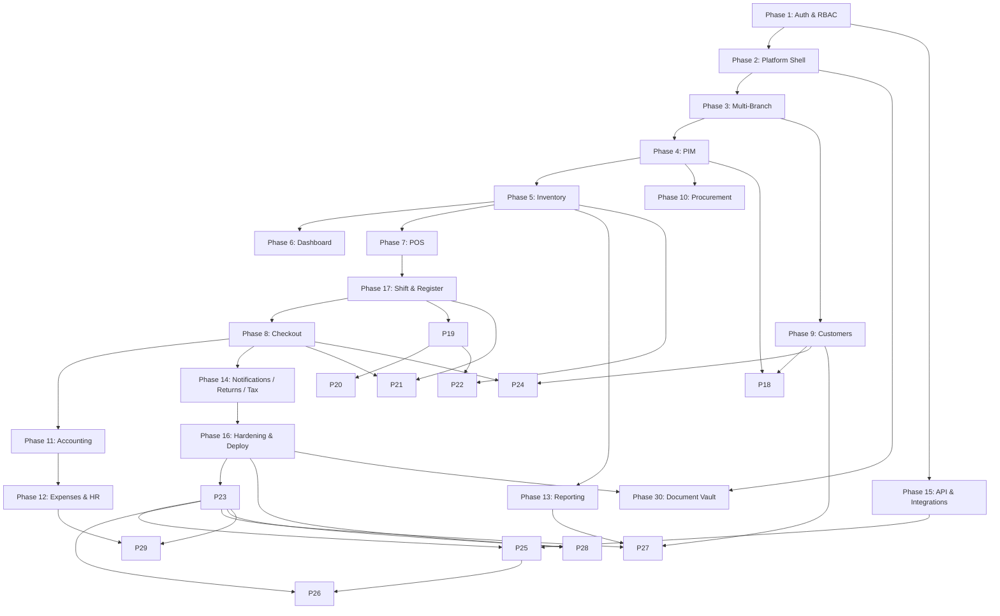

# RetailPulse — Development Phases

This folder breaks the [SRS](../srs.md) into sequential, shippable phases. Each phase has its own document with scope, deliverables, database notes, and acceptance criteria.

**Principle:** Complete and stabilize each phase before starting the next. Phase 1 is the security and identity foundation; every later module depends on it.

| Phase | Document | SRS Sections | Summary |
| :--- | :--- | :--- | :--- |
| **1** | [phase-01-super-admin-auth-rbac.md](./phase-01-super-admin-auth-rbac.md) | 3.1, 3.2, 4.3 (partial), 4.4 (partial) | Super Admin login, Breeze (Inertia + React) auth, Spatie RBAC, user/role/permission management |
| **2** | [phase-02-platform-shell.md](./phase-02-platform-shell.md) | 2, 4.7 (partial), 4.8 (partial) | Inertia + React 19, shadcn/ui, admin layout, command palette shell |
| **3** | [phase-03-multi-branch.md](./phase-03-multi-branch.md) | 3.4 | Branches, head-office console, per-branch settings; **warehouse CRUD follow-up** (permission-gated) |
| **4** | [phase-04-product-information.md](./phase-04-product-information.md) | 3.5, 3.18 | PIM: products, variants, batches, SKUs, barcodes; preferred supplier; **product bulk import/export** |
| **5** | [phase-05-inventory-warehouse.md](./phase-05-inventory-warehouse.md) | 3.6, 3.18 | Stock ledger, bin locations, cycle count, quarantine, reorder; **import framework + opening stock per bin** |
| **6** | [phase-06-dashboard-realtime.md](./phase-06-dashboard-realtime.md) | 3.3, 4.1 | KPI dashboard, Reverb WebSockets, activity feed, charts |
| **7** | [phase-07-point-of-sale.md](./phase-07-point-of-sale.md) | 3.7, 4.2 (partial) | POS UI, multi-cart, keyboard nav, offline queue foundation |
| **17** | [phase-17-shift-register-management.md](./phase-17-shift-register-management.md) | 3.20 | Registers, shift open/close (required before sales), X/Z reports, variance approval, no-sale log |
| **8** | [phase-08-checkout-payments-invoicing.md](./phase-08-checkout-payments-invoicing.md) | 3.8, 3.18 | Split tender, layaway, credit sales, invoices, COGS trigger; **historical sales import** |
| **9** | [phase-09-customers-loyalty.md](./phase-09-customers-loyalty.md) | 3.9, 3.18 | CRM, loyalty tiers, wallets, AR aging; **customer bulk import/export** |
| **10** | [phase-10-suppliers-procurement.md](./phase-10-suppliers-procurement.md) | 3.10, 3.18 | PO → GRN → 3-way match → invoice → payment; RMA, landed cost, supplier price lists |
| **11** | [phase-11-accounting-finance.md](./phase-11-accounting-finance.md) | 3.11, 3.18 | COGS posting, chart of accounts, multi-currency, intercompany; **COA + opening balance import** |
| **12** | [phase-12-expenses-hr-payroll.md](./phase-12-expenses-hr-payroll.md) | 3.12, 3.13 | Expenses, attendance, payroll, leave management, overtime, payslips |
| **13** | [phase-13-reporting-analytics.md](./phase-13-reporting-analytics.md) | 3.14 | Reports, AP/AR aging, custom report builder, Excel/PDF export |
| **14** | [phase-14-notifications-returns-tax.md](./phase-14-notifications-returns-tax.md) | 3.15, 3.16, 3.17 | Notifications, returns/disposition, composite tax, WHT, tax return exports |
| **15** | [phase-15-api-integrations.md](./phase-15-api-integrations.md) | 4.5, 6 | REST API v1, Sanctum tokens, webhooks, per-token quotas, payment/comms integrations |
| **16** | [phase-16-hardening-deployment.md](./phase-16-hardening-deployment.md) | 4.2–4.10, 7 | 2FA, sessions, DR/RTO/RPO, testing strategy, caching, i18n, DevOps |
| **18** | [phase-18-pricing-promotions.md](./phase-18-pricing-promotions.md) | 3.21 | Price lists, BOGO/bundle/cart/category promotions, coupon engine |
| **19** | [phase-19-restaurant-core.md](./phase-19-restaurant-core.md) | 3.19 | Floors, tables, KOT lifecycle, order types, service charge, real-time updates |
| **20** | [phase-20-restaurant-advanced.md](./phase-20-restaurant-advanced.md) | 3.19 | Waiter panel, KDS, split billing, modifiers, reservations, delivery stubs |
| **21** | [phase-21-hardware-integration.md](./phase-21-hardware-integration.md) | 3.22 | ESC/POS printers, cash drawer, barcode scanner, scale stub, card terminal stub |
| **22** | [phase-22-recipe-ingredients.md](./phase-22-recipe-ingredients.md) | 3.23 | Raw materials, BOM service, auto-deduct on sale, production batches |
| **23** | [phase-23-module-config-engine.md](./phase-23-module-config-engine.md) | 3.24, 3.25 | Module registry, feature flags, CheckModuleEnabled middleware, dynamic sidebar, 4-tier config |
| **24** | [phase-24-gift-cards-store-credits.md](./phase-24-gift-cards-store-credits.md) | 3.26 | Gift card issuance (physical/digital), POS redemption, store credits on returns |
| **25** | [phase-25-ecommerce-integration.md](./phase-25-ecommerce-integration.md) | 3.27 | Shopify/WooCommerce product sync, inventory push, order pull, customer merge |
| **26** | [phase-26-mobile-apps.md](./phase-26-mobile-apps.md) | 3.28 | Customer, Waiter, Scanner, Manager & Employee apps (React Native + FCM push) |
| **27** | [phase-27-bi-analytics.md](./phase-27-bi-analytics.md) | 3.29 | Data mart ETL (incl. AR aging), Power BI/Tableau connector, AI demand forecast stub |
| **28** | [phase-28-saas-multitenancy.md](./phase-28-saas-multitenancy.md) | 4.8, 3.24 | Tenant isolation, plans, subscriptions, onboarding wizard, Stripe stub |
| **29** | [phase-29-workflow-engine.md](./phase-29-workflow-engine.md) | 3.30 | Configurable approval workflows, SLA escalation, pre-built definitions, visual builder |
| **30** | [phase-30-document-vault.md](./phase-30-document-vault.md) | 3.31 | Polymorphic document attachments, signed URLs, RBAC, retention policies |

## Dependency Graph

## Current Status

| Phase | Status |
| :--- | :--- |
| 1–7 | ✅ Complete |
| 8 | 🔄 In Progress |
| 9–16 | 📋 Planned (core business roadmap) |
| 17–30 | 📋 Planned (SRS v4.0 scope — includes v3.0 modules plus gap-analysis additions) |

**Note:** Phase 17 (Shift & Register) is delivered **after Phase 7 and before Phase 8** per SRS §3.20 — cashiers must open a shift before completing sales.

---

**Start here:** [Phase 1 — Super Admin, Authentication & RBAC](./phase-01-super-admin-auth-rbac.md)
