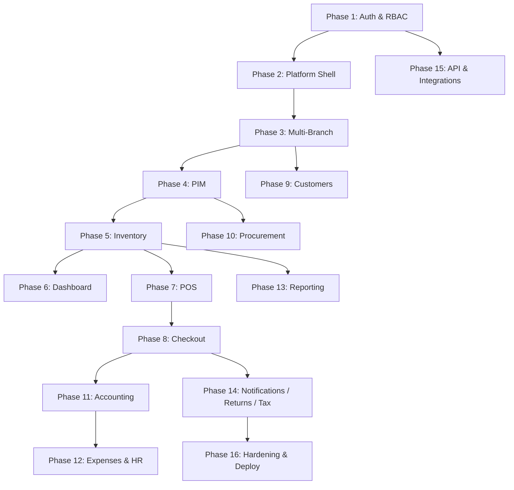

# RetailPulse — Development Phases

This folder breaks the [SRS](../srs.md) into sequential, shippable phases. Each phase has its own document with scope, deliverables, database notes, and acceptance criteria.

**Principle:** Complete and stabilize each phase before starting the next. Phase 1 is the security and identity foundation; every later module depends on it.

| Phase | Document | SRS Sections | Summary |
| :--- | :--- | :--- | :--- |
| **1** | [phase-01-super-admin-auth-rbac.md](./phase-01-super-admin-auth-rbac.md) | 3.1, 3.2, 4.3 (partial), 4.4 (partial) | Super Admin login, Breeze (Inertia + React) auth, Spatie RBAC, user/role/permission management |
| **2** | [phase-02-platform-shell.md](./phase-02-platform-shell.md) | 2, 4.7 (partial), 4.8 (partial) | Inertia + React 19, shadcn/ui, admin layout, command palette shell |
| **3** | [phase-03-multi-branch.md](./phase-03-multi-branch.md) | 3.4 | Branches, warehouses, head-office console, per-branch settings |
| **4** | [phase-04-product-information.md](./phase-04-product-information.md) | 3.5 | PIM: products, variants, batches, SKUs, barcodes |
| **5** | [phase-05-inventory-warehouse.md](./phase-05-inventory-warehouse.md) | 3.6 | Stock ledger, movements, transfers, negative-stock prevention |
| **6** | [phase-06-dashboard-realtime.md](./phase-06-dashboard-realtime.md) | 3.3, 4.1 | KPI dashboard, Reverb WebSockets, activity feed, charts |
| **7** | [phase-07-point-of-sale.md](./phase-07-point-of-sale.md) | 3.7, 4.2 (partial) | POS UI, multi-cart, keyboard nav, offline queue foundation |
| **8** | [phase-08-checkout-payments-invoicing.md](./phase-08-checkout-payments-invoicing.md) | 3.8 | Split tender, layaway, credit sales, invoices |
| **9** | [phase-09-customers-loyalty.md](./phase-09-customers-loyalty.md) | 3.9 | CRM, loyalty tiers, wallets, store credit |
| **10** | [phase-10-suppliers-procurement.md](./phase-10-suppliers-procurement.md) | 3.10 | PO → GRN → supplier invoice → payment |
| **11** | [phase-11-accounting-finance.md](./phase-11-accounting-finance.md) | 3.11 | Chart of accounts, journal entries, financial statements |
| **12** | [phase-12-expenses-hr-payroll.md](./phase-12-expenses-hr-payroll.md) | 3.12, 3.13 | Expenses, attendance, payroll |
| **13** | [phase-13-reporting-analytics.md](./phase-13-reporting-analytics.md) | 3.14 | Reports, custom report builder, Excel/PDF export |
| **14** | [phase-14-notifications-returns-tax.md](./phase-14-notifications-returns-tax.md) | 3.15, 3.16, 3.17 | Notifications, refunds/returns, tax engine |
| **15** | [phase-15-api-integrations.md](./phase-15-api-integrations.md) | 4.5, 6 | REST API v1, Sanctum tokens, webhooks, payment/comms integrations |
| **16** | [phase-16-hardening-deployment.md](./phase-16-hardening-deployment.md) | 4.2–4.8, 7 | 2FA, sessions, caching, i18n, audit compliance, DevOps |

## Dependency Graph

## Current Status

| Phase | Status |
| :--- | :--- |
| 1 | **Not started** — ready for implementation |
| 2–16 | Planned |

---

**Start here:** [Phase 1 — Super Admin, Authentication & RBAC](./phase-01-super-admin-auth-rbac.md)
