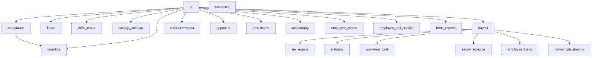

# Phase 12 — Enterprise HRMS Modular SRS

**SRS Reference:** §3.12, §3.13  
**Status:** Foundation Partial / Implemented — Enterprise expansion Planned (see [module-registry.md](./module-registry.md))  
**Depends on:** Phase 11 (Accounting), Phase 7 (optional POS attendance source), Phase 1 (RBAC), Phase 3 (branches / legal entities)  
**Related:** Phase 23 (Module Config Engine), Phase 26 (Employee mobile), Phase 29 (Workflow Engine)  
**Legacy pointer:** [../phase-12-expenses-hr-payroll.md](../phase-12-expenses-hr-payroll.md)

---

## 1. Objective

RetailPulse Phase 12 is the **Enterprise HRMS and operating-expense** specification: modular, configuration-driven, accounting-decoupled, and buildable wave-by-wave while remaining independently sellable.

No expense category, salary component, overtime rule, leave policy, tax method, provident-fund rule, approval limit, holiday, or numbering scheme may be hardcoded in business logic.

---

## 2. How to read this set

1. Read **[architecture.md](./architecture.md)** once (binding NFRs, accounting events, gating, migration contract).
2. Use **[module-registry.md](./module-registry.md)** for sellable gates, dependencies, and roll-up status.
3. Implement **one module file at a time** — each SRS is independently sufficient for its domain when combined with architecture + registry.
4. Track unfinished FRs in **[gaps.md](./gaps.md)**.

Every module document states: *This module follows the Phase 12 Architecture Principles.* Requirements carry status: `Implemented` | `Partial` | `Planned`.

---

## 3. Module dependency graph

`expenses` has no hard dependency on `hr` (accounting posting optional).

---

## 4. Build waves (recommended delivery sequence)

Modules remain independently enableable; waves are the recommended implementation order.

### Wave 1 — HR foundation

* HR Core, Employees, Departments, Designations, Grades, Reporting Hierarchy, Holiday Calendar

### Wave 2 — Time & leave

* Attendance, Shifts & Roster, Leave, Leave Policies, Leave Fiscal Year, Overtime

### Wave 3 — Compensation engines

* Payroll Core, Payroll Scheduling, Deductions, Tax Engine, Statutory, Provident Fund, Salary Advances, Employee Loans, Payroll Adjustments, Payroll Reports, Expenses, Reimbursements

### Wave 4 — Talent, ESS, ops

* KPI, KRA, Appraisal, Compensation, ESS, Recruitment (ATS), Onboarding & Offboarding, Asset Management, Reports, Historical Migration, Configuration Framework

---

## 5. Document index

| Wave | Document | Gate / area | Roll-up status |
| :--- | :--- | :--- | :---: |
| — | [architecture.md](./architecture.md) | Cross-cutting | Binding |
| — | [module-registry.md](./module-registry.md) | Licensing / deps | Binding |
| — | [gaps.md](./gaps.md) | Residuals | Living |
| 1 | [hr-core.md](./hr-core.md) | `hr` | Partial |
| 1 | [employees.md](./employees.md) | `hr` | Partial |
| 1 | [departments.md](./departments.md) | `hr` | Planned |
| 1 | [designations.md](./designations.md) | `hr` | Planned |
| 1 | [grades.md](./grades.md) | `hr` | Planned |
| 1 | [reporting-hierarchy.md](./reporting-hierarchy.md) | `hr` | Planned |
| 1 | [holiday-calendar.md](./holiday-calendar.md) | `holiday_calendar` | Planned |
| 2 | [attendance.md](./attendance.md) | `attendance` | Implemented |
| 2 | [shifts-roster.md](./shifts-roster.md) | `shifts_roster` | Planned |
| 2 | [leave.md](./leave.md) | `leave` | Partial |
| 2 | [leave-policies.md](./leave-policies.md) | `leave` | Partial |
| 2 | [leave-fiscal-year.md](./leave-fiscal-year.md) | `leave` | Partial |
| 2 | [overtime.md](./overtime.md) | `overtime` | Implemented |
| 3 | [payroll-core.md](./payroll-core.md) | `payroll` | Partial |
| 3 | [payroll-scheduling.md](./payroll-scheduling.md) | `payroll` | Planned |
| 3 | [payroll-adjustments.md](./payroll-adjustments.md) | `payroll_adjustments` | Planned |
| 3 | [payroll-reports.md](./payroll-reports.md) | `payroll` | Partial |
| 3 | [deductions.md](./deductions.md) | `payroll` | Partial |
| 3 | [statutory.md](./statutory.md) | `statutory` | Partial |
| 3 | [tax-engine.md](./tax-engine.md) | `tax_engine` | Partial |
| 3 | [provident-fund.md](./provident-fund.md) | `provident_fund` | Planned |
| 3 | [salary-advance.md](./salary-advance.md) | `salary_advance` | Partial |
| 3 | [employee-loans.md](./employee-loans.md) | `employee_loans` | Planned |
| 3 | [expenses.md](./expenses.md) | `expenses` | Implemented |
| 3 | [reimbursements.md](./reimbursements.md) | `reimbursements` | Planned |
| 4 | [kpi.md](./kpi.md) | `appraisal` | Planned |
| 4 | [kra.md](./kra.md) | `appraisal` | Planned |
| 4 | [appraisal.md](./appraisal.md) | `appraisal` | Planned |
| 4 | [compensation.md](./compensation.md) | `appraisal` | Planned |
| 4 | [employee-self-service.md](./employee-self-service.md) | `employee_self_service` | Partial |
| 4 | [recruitment-ats.md](./recruitment-ats.md) | `recruitment` | Planned |
| 4 | [onboarding-offboarding.md](./onboarding-offboarding.md) | `onboarding` | Planned |
| 4 | [asset-management.md](./asset-management.md) | `employee_assets` | Planned |
| 4 | [reports.md](./reports.md) | `hrms_reports` | Planned |
| 4 | [historical-migration.md](./historical-migration.md) | Cross-cutting | Partial |
| 4 | [configuration-framework.md](./configuration-framework.md) | Cross-cutting | Partial |

---

## 6. User documentation

Operational UI for shipped foundation features: [user-manual-hr-and-payroll.md](../../user-manual-hr-and-payroll.md).  
GL posting behaviour: [user-manual-accounting-and-finance.md](../../user-manual-accounting-and-finance.md).
