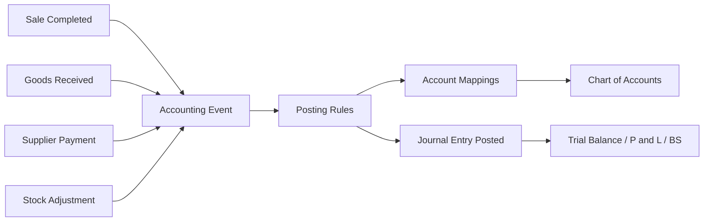

# RetailPulse User Manual — Accounting & Finance

**Audience:** Accountants, finance managers, implementation consultants, and customer support  
**Version:** 1.6 (July 2026)  
**Scope:** Phase 11 — General Ledger (GL), auto-posting, fiscal control, tax, imports, sub-ledgers, inventory costing, and financial reports

This manual explains **where to click**, **what each screen does**, **how money flows through the system**, **what every term means**, and **what happens when something is missing or misconfigured**.

**See also:**
- [`phases/phase-11-accounting-finance.md`](phases/phase-11-accounting-finance.md) — technical specification and data model
- [`user-manual-customers-and-loyalty.md`](user-manual-customers-and-loyalty.md) — AR, credit limits, customer payments (feeds accounting)
- [`generic-import-export.md`](generic-import-export.md) — CSV upload mechanics for COA and opening balances
- [`phases/phase-08-checkout-payments-invoicing.md`](phases/phase-08-checkout-payments-invoicing.md) — POS sales that trigger `sale.completed`
- [`phases/phase-10-suppliers-procurement.md`](phases/phase-10-suppliers-procurement.md) — GRN, supplier invoices, payments

---

## Table of contents

1. [Before you start](#1-before-you-start)
2. [Glossary — terms and abbreviations](#2-glossary--terms-and-abbreviations)
3. [How accounting works — the big picture](#3-how-accounting-works--the-big-picture)
4. [Admin navigation map](#4-admin-navigation-map)
5. [Recommended setup sequence](#5-recommended-setup-sequence)
6. [Chart of Accounts](#6-chart-of-accounts)
7. [Account Mappings](#7-account-mappings)
8. [Posting Rules](#8-posting-rules)
9. [Financial Settings](#9-financial-settings)
10. [Fiscal years — open, close, and reopen](#10-fiscal-years--open-close-and-reopen)
11. [Journal entries (manual GL)](#11-journal-entries-manual-gl)
12. [Accounting events (automatic posting)](#12-accounting-events-automatic-posting)
13. [Tax configuration and posting](#13-tax-configuration-and-posting)
14. [Cost centres](#14-cost-centres)
15. [Imports — Chart of Accounts and opening balances](#15-imports--chart-of-accounts-and-opening-balances)
16. [Sub-modules](#16-sub-modules)
17. [Financial reports](#17-financial-reports)
18. [How operational modules link to accounting](#18-how-operational-modules-link-to-accounting)
19. [End-to-end flow examples](#19-end-to-end-flow-examples)
20. [Permissions reference (for support)](#20-permissions-reference-for-support)
21. [Troubleshooting & FAQ](#21-troubleshooting--faq)

---

## 1. Before you start

### 1.1 What this manual covers

| Area | What you can do |
|------|-----------------|
| **Core GL** | Chart of Accounts, account mappings, posting rules, journal entries, accounting events |
| **Fiscal control** | Fiscal years, period lock, year-end close, approved reopen windows |
| **Tax** | Tax types, default sales/purchase tax, tax lines on journals |
| **Imports** | Staged COA import, opening balance import with AR/AP reconciliation |
| **Inventory costing** | Default valuation method, cost layers, opening stock unit cost, manual cost-layer backfill |
| **Sub-modules** | Cost centres, credit notes, bank accounts & reconciliation, multi-currency, petty cash, cheques, fixed assets |
| **Reports** | Trial balance, P&L, balance sheet, GL, AR/AP aging, and more |

**Not covered in depth here:** Payroll journals (Phase 12), full expense module, Phase 23 module registry UI (sub-module toggles are branch-profile based for now).

### 1.2 Dependencies on other modules

Accounting does **not** replace operational modules. It **records** their financial effect:

| Operational module | Accounting trigger |
|--------------------|-------------------|
| POS / Checkout (Phase 8) | `sale.completed` when a sale is confirmed |
| Customers (Phase 9) | AR balances, credit notes, write-offs |
| Procurement (Phase 10) | `purchase.received`, `purchase.invoice_posted`, `payment.made` |
| Inventory (Phase 5) | `inventory.adjusted`, `stock.scrapped`, `transfer.confirmed`, COGS on sales |

If Sales or Procurement is not in use, you can still run accounting with **manual journals** and **opening balance imports**.

### 1.3 Branch context (critical)

RetailPulse accounting is **branch-aware**:

- **Select a specific branch** in the header branch switcher before working in Accounting.
- When a **specific branch** is active, the sidebar shows only the sub-modules that branch has enabled in its accounting profile.
- When **All Branches** (head-office view — the default for super-admin) is active, the sidebar shows the **union** of every branch's enabled sub-modules, so an unrestricted user can reach any configured accounting area. If a sub-module is enabled on at least one branch, it appears here.
- **If a sub-module is still missing:** confirm it is enabled on at least one `BranchAccountingProfile`, then refresh.

Journal lines, bank accounts, and many reports filter by the active branch unless the user has head-office (all-branches) access.

### 1.4 Accounting sub-modules (feature gating)

Beyond permissions, some menu items require the branch to have the sub-module **enabled** in `branch_accounting_profiles.accounting_enabled_modules`.

| Module key | Sidebar items unlocked |
|------------|------------------------|
| `core` | Always on — COA, mappings, rules, journals, settings, reports, events |
| `ar_ap` | Required for credit notes sub-module |
| `tax` | Tax Types |
| `cost_centres` | Cost Centres |
| `multi_currency` | Currencies |
| `bank_reconciliation` | Bank Accounts, Bank Reconciliation |
| `petty_cash` | Petty Cash |
| `cheques` | Cheques |
| `fixed_assets` | Fixed Assets |
| `credit_notes` | Credit Notes (also needs `ar_ap`) |
| `intercompany` | Intercompany (also needs `multi_currency`) |

**Default for a new branch:** only `core` is enabled. An administrator must enable additional modules under **Accounting → Accounting Modules** (permission `accounting.manage-modules`).

**What if a sub-module is not enabled?**
- The menu item is hidden.
- Direct URL access returns **403 Forbidden**.
- Auto-posting for events in that area may still run if triggered, but related admin screens are blocked.

### 1.5 Roles and permissions

Menu items appear only when the user has the required permission **and** (where applicable) the branch module is enabled. If a user says “I don’t see Tax Types”, check:

1. `tax` module enabled for the active branch — or, in the All Branches view, on at least one branch.
2. Role has `accounting.manage-tax-settings` (or super-admin).

See [Section 20](#20-permissions-reference-for-support).

### 1.6 Core principles (what the system enforces)

| Principle | What it means for users |
|-----------|-------------------------|
| **Double-entry** | Every posted journal has equal total debits and credits. Unbalanced journals cannot post. |
| **Immutability** | Posted journals cannot be edited. Mistakes are corrected with a **reversal** journal. |
| **Idempotency** | The same sale or payment cannot create two GL journals if the system retries. |
| **Configuration, not hardcoding** | GL accounts come from COA + mappings + rules — not baked into POS or procurement code. |
| **Period lock** | Closed fiscal years block new postings unless an approved **reopen window** is active. |
| **Audit trail** | COA, mappings, journals, fiscal close, and many sub-ledger actions are audit-logged. |

---

## 2. Glossary — terms and abbreviations

### 2.1 General ledger

| Term | Meaning |
|------|---------|
| **GL / General Ledger** | The complete record of all financial accounts and posted journal lines. |
| **Chart of Accounts (COA)** | The master list of GL accounts (codes, names, types, hierarchy). |
| **Account code** | Unique identifier for a GL account (e.g. `1100` Cash, `4100` Sales Revenue). |
| **Account type** | One of: **Asset**, **Liability**, **Equity**, **Revenue**, **Expense**. Drives balance sheet vs P&L classification. |
| **Group account** | Parent/header account used for reporting hierarchy. **Cannot** receive journal postings (`is_postable = false`). |
| **Postable account** | Leaf account that accepts journal lines. |
| **Journal entry / voucher (JV)** | A header (date, description, status) plus one or more **journal lines**. |
| **Journal line / transaction** | One row: account, debit OR credit, optional dimensions (cost centre, tax type, party). |
| **Debit** | Increases assets and expenses; decreases liabilities, equity, and revenue (in standard accounting). |
| **Credit** | Opposite of debit. System enforces **debits = credits** before posting. |
| **Draft journal** | Created but not yet posted. Can be edited or deleted from Journal Entries (status **Draft** only; requires `accounting.create-journal`). |
| **Posted journal** | Finalized in the GL. Immutable except via reversal. |
| **Reversal** | System-generated offsetting journal that negates a posted entry. |
| **Opening balance** | Initial GL balances at go-live, flagged `is_opening_balance = true`. |
| **Closing entry** | Year-end journal moving net income to retained earnings. |
| **Functional currency** | The tenant’s primary reporting currency (set in Financial Settings). |

### 2.2 Configuration layer

| Term | Meaning |
|------|---------|
| **Account mapping** | A rule that says “when the system needs key X, use GL account Y” — optionally scoped by branch, warehouse, payment method, or currency. |
| **Mapping key** | Named resolver key (e.g. `sales_revenue`, `accounts_receivable`, `output_tax`). Used by posting rules. |
| **Posting rule set** | A versioned set of lines that define how an **accounting event type** becomes journal lines. |
| **Posting rule line** | One line in a rule: side (debit/credit), **amount source**, **account resolution type**. |
| **Amount source** | Where the line amount comes from in the event payload (e.g. `gross_amount`, `tax_amount`, `inventory_cost`). |
| **Account resolution type** | How to find the GL account (fixed ID, mapping key, payment method, tax account, bank account, etc.). |
| **Accounting event** | A recorded business occurrence (e.g. `sale.completed`) waiting to be or already converted to a journal. |
| **Idempotency key** | Unique key `event_type:source_type:source_id` preventing duplicate auto-journals. |

### 2.3 Fiscal and control

| Term | Meaning |
|------|---------|
| **Fiscal year (FY)** | A defined date range (e.g. 1 Jan – 31 Dec 2026) for period reporting and lock. |
| **Fiscal year status** | `open`, `closing`, `closed`, or `reopening`. Controls whether posting is allowed. |
| **Cutover date** | First date operational auto-posting is allowed. Earlier dates may be blocked for imports/journals. |
| **Reopen window** | Temporary period after dual-approved reopen during which posting to a closed year is allowed again (configurable hours, default 48). |
| **Retained earnings** | Equity account receiving year-end profit/loss transfer. Required for fiscal close. |

### 2.4 Tax

| Term | Meaning |
|------|---------|
| **Tax type** | Configured rate and method (e.g. GST 5%, VAT 20%) linked to output/input GL accounts. |
| **Output tax** | Tax collected on sales (liability). |
| **Input tax** | Tax paid on purchases (asset or recoverable). |
| **Recoverable percentage** | On purchases, the portion of input tax that can be claimed (e.g. 100% or partial). |
| **Exclusive tax** | Tax added on top of net price (100 + 5% = 105 gross). |
| **Inclusive tax** | Tax embedded in price (105 inclusive of 5% → net 100). |

### 2.5 Sub-ledgers and sub-modules

| Term | Meaning |
|------|---------|
| **AR / Accounts Receivable** | Money customers owe you. Control account in GL; detail in customer sub-ledger. |
| **AP / Accounts Payable** | Money you owe suppliers. Control account in GL; detail in supplier sub-ledger. |
| **Cost centre** | Departmental or project dimension on journal lines for management P&L. |
| **Bank reconciliation** | Matching bank statement lines to posted GL/business transactions. |
| **Petty cash** | Small-cash imprest register with top-up and disbursement vouchers. |
| **Cheque register** | Lifecycle tracking for cheques received/issued with optional GL posting. |
| **Fixed asset** | Capitalized item depreciated over time. |
| **Credit note** | Reduces customer AR (refund or adjustment). Triggers `credit_note.issued` accounting event. |
| **Debit note** | Reduces supplier AP (purchase return adjustment). Issued from Procurement, not a standalone Accounting menu item. Triggers `debit_note.issued`. |

### 2.6 Abbreviations

| Abbr. | Full form |
|-------|-----------|
| **COA** | Chart of Accounts |
| **GL** | General Ledger |
| **JV** | Journal Voucher / Journal Entry |
| **FY** | Fiscal Year |
| **P&L** | Profit and Loss (Income Statement) |
| **TB** | Trial Balance |
| **GRN** | Goods Receiving Note |
| **COGS** | Cost of Goods Sold |
| **WAC** | Weighted Average Cost |
| **FIFO** | First In, First Out |
| **Cost layer** | A quantity/cost record for received stock used to compute COGS on sales (FIFO or WAC). |
| **AR** | Accounts Receivable |
| **AP** | Accounts Payable |
| **FX** | Foreign Exchange |

---

## 3. How accounting works — the big picture

### 3.1 Three layers

```
┌─────────────────────────────────────────────────────────────┐
│  OPERATIONAL MODULES (POS, Procurement, Inventory, AR/AP)   │
│  User completes a sale, receives goods, adjusts stock…      │
└──────────────────────────┬──────────────────────────────────┘
                           │ domain events (SaleCompleted, etc.)
                           ▼
┌─────────────────────────────────────────────────────────────┐
│  ACCOUNTING EVENT PIPELINE                                   │
│  AccountingEventService → PostingRuleEngine → JournalService │
└──────────────────────────┬──────────────────────────────────┘
                           │ posted journal lines
                           ▼
┌─────────────────────────────────────────────────────────────┐
│  GENERAL LEDGER + REPORTS                                    │
│  journal_entries + journal_transactions → Trial Balance, P&L │
└─────────────────────────────────────────────────────────────┘
```

**Nothing in POS hardcodes account 4100.** Instead:

1. POS completes a sale → listener fires `sale.completed` with amounts in the payload.
2. **Posting rule** for `sale.completed` says: debit payment-method account, credit sales revenue, credit output tax, debit COGS, credit inventory (as configured).
3. **Account mappings** resolve `sales_revenue` → account `4100`, `output_tax` → `2200`, etc.
4. **JournalService** validates balance and fiscal period, then posts.

### 3.2 Configuration stack (bottom to top)

| Layer | You configure | Effect |
|-------|---------------|--------|
| 1. Chart of Accounts | Account codes, types, hierarchy | Defines *what accounts exist* |
| 2. Account Mappings | Keys → accounts (+ dimensions) | Defines *which account to pick* for each business concept |
| 3. Posting Rules | Event type → debit/credit lines | Defines *how events become journals* |
| 4. Financial Settings | Currency, retained earnings, tax defaults, cutover | Global behaviour and defaults |
| 5. Tax Types | Rates and tax GL accounts | Tax line stamping on journals |
| 6. Fiscal Years | Open/close/reopen | *When* posting is allowed |

If layer 1–3 is incomplete, auto-posting **fails** or is **skipped** (see [Section 12](#12-accounting-events-automatic-posting)).

### 3.3 What “reflects” where

| You do this… | System records… | You see it in… |
|--------------|-----------------|----------------|
| Complete a POS sale | `sale.completed` → revenue, tax, cash/card, COGS | Journal Entries, GL, P&L, Trial Balance |
| Receive goods (GRN) | `purchase.received` → inventory + GRNI/clearing | Journal Entries, Inventory Valuation report |
| Match supplier invoice | `purchase.invoice_posted` → AP, input tax | AP Aging, Journal Entries |
| Pay supplier | `payment.made` → bank + AP | Bank Book, AP Aging |
| Issue credit note | `credit_note.issued` → reduce AR/revenue | Credit Notes list, AR Aging |
| Adjust inventory | `inventory.adjusted` or `stock.scrapped` | Journal Entries, Inventory Valuation |
| Receive stock transfer | `transfer.confirmed` | Inter-warehouse inventory GL (if rules configured) |
| Close fiscal year | Closing journal → retained earnings | Fiscal year status = Closed; P&L rolls forward |
| Import opening balances | Opening journal (after approval) | TB, Balance Sheet at cutover |

### 3.4 Synchronous posting

Auto-posting runs **synchronously** in the same request as the business operation (no background queue for the main pipeline). If posting fails, the operational transaction may still complete, but the **Accounting Events** screen shows a **Failed** event with an error message for retry or correction.

---

## 4. Admin navigation map

**Path prefix:** Admin → sidebar section **Accounting**

### 4.1 Core items (always visible with permission)

| Menu item | Route | Typical permission |
|-----------|-------|-------------------|
| Chart of Accounts | Accounting → Chart of Accounts | `accounting.view` / `accounting.manage-coa` |
| Account Mappings | Accounting → Account Mappings | `accounting.manage-mappings` |
| Posting Rules | Accounting → Posting Rules | `accounting.manage-posting-rules` |
| Journal Entries | Accounting → Journal Entries | `accounting.view` |
| Financial Settings | Accounting → Financial Settings | `accounting.manage-fiscal-years` or `accounting.view` |
| Accounting Modules | Accounting → Accounting Modules | `accounting.manage-modules` |
| Create Cost Layer | Accounting → Create Cost Layer | `accounting.manage-fiscal-years` |
| Financial Reports | Accounting → Financial Reports | `accounting.view-reports` |
| Accounting Events | Accounting → Accounting Events | `accounting.view` |

### 4.2 Sub-module items (branch module + permission)

| Menu item | Module key | Permission |
|-----------|------------|------------|
| Cost Centres | `cost_centres` | `accounting.manage-cost-centres` |
| Credit Notes | `credit_notes` (+ `ar_ap`) | `accounting.view` |
| Tax Types | `tax` | `accounting.manage-tax-settings` |
| Bank Accounts | `bank_reconciliation` | `accounting.manage-bank-accounts` |
| Bank Reconciliation | `bank_reconciliation` | `accounting.reconcile-bank` |
| Currencies | `multi_currency` | `accounting.view` |
| Petty Cash | `petty_cash` | `accounting.manage-petty-cash` (create); `accounting.approve-petty-cash` (approve/reject) |
| Cheques | `cheques` | `accounting.manage-cheques` |
| Fixed Assets | `fixed_assets` | `accounting.manage-assets` |

### 4.3 Imports (no dedicated sidebar item)

COA and opening balance **uploads** live under the global **Import / Export** flow (`Admin → Settings` or Import Export UI per your deployment). **Approval** of staged batches is via accounting routes after upload completes.

---

## 5. Recommended setup sequence

Use this order for a new tenant go-live:

| Step | Action | Why |
|------|--------|-----|
| 1 | Enable required accounting sub-modules for each branch | Unlocks sidebar and routes |
| 2 | Configure **Financial Settings** (currency, retained earnings, cutover date, tax defaults, **inventory valuation**, **cash/bank mappings**) | Required for close, tax, COGS, and cash-flow reports |
| 3 | Create or import **Chart of Accounts** | Accounts must exist before mappings |
| 4 | Review **Account Mappings** (seeded defaults or custom) | Posting rules resolve accounts through mappings |
| 5 | Review **Posting Rules** (seeded defaults or custom) | Defines auto-journal structure per event |
| 6 | Create **Fiscal Year** covering go-live date | Posting requires an open FY for the journal date |
| 7 | Import **opening balances** → validate → **approve** | Loads starting TB without double-counting operations |
| 8 | Configure **Tax Types** if using tax module | Tax lines need types and GL links |
| 9 | Optional: Bank accounts, cost centres, petty cash, etc. | Sub-module setup |
| 10 | Run a test sale / GRN in sandbox | Verify Accounting Events → Completed and TB movement |

**What if you skip a step?**

| Skipped step | Symptom |
|--------------|---------|
| Fiscal year | Post fails: “fiscal period closed” or no FY for date |
| Mappings | Post fails: “could not resolve account for mapping key …” |
| Posting rules | Event status **Skipped** (no rule set for event type) |
| Retained earnings account | Fiscal year **close** fails |
| Cutover date | Journals before cutover may be blocked |
| Opening balance approval | No starting balances in TB; operational postings only |

---

## 6. Chart of Accounts

**Menu:** Accounting → Chart of Accounts

### 6.1 What it is

The COA is the backbone of the GL. Every journal line points to exactly one COA account.

### 6.2 Account fields (what they mean)

| Field | Meaning |
|-------|---------|
| **Code** | Unique per branch (or global). Used in imports and reports. |
| **Name** | Display name on journals and reports. |
| **Type** | Asset / Liability / Equity / Revenue / Expense — determines financial statement section. |
| **Parent** | Optional hierarchy. Parent should be a **group** account. |
| **Is group** | If yes, account is a header only — not postable. |
| **Is postable** | If yes, journal lines can use this account. |
| **Branch** | Optional branch scope for branch-specific accounts. |
| **Status** | Active accounts are used in new postings; inactive are hidden from pickers. |

### 6.3 Typical default structure (seeded)

| Code range | Type | Examples |
|------------|------|----------|
| 1xxx | Asset | Cash 1100, Bank 1210, AR 1300, Inventory 1400 |
| 2xxx | Liability | AP 2100, Output tax 2200 |
| 3xxx | Equity | Opening balance equity 3400, Retained earnings |
| 4xxx | Revenue | Sales 4100, Sales returns 4150 |
| 5xxx | Expense | COGS 5100, Adjustments 5910 |

### 6.4 Common actions

| Action | How |
|--------|-----|
| Create account | Chart of Accounts → New — set code, name, type, postable flag |
| Edit account | Row action → Edit (avoid changing code after postings exist) |
| Deactivate | Set status inactive — existing history remains |
| Bulk load | Import CSV via Import Export (`coa` entity) — see [Section 15](#15-imports--chart-of-accounts-and-opening-balances) |

### 6.5 What if…

| Situation | What happens |
|-----------|----------------|
| Account code does not exist | Import/mapping/post fails with validation error |
| Posting to a group account | Blocked — group accounts are not postable |
| Duplicate code same branch | Import validation fails; manual create may error |
| Wrong account type | TB and financial statements misclassified — fix with reversal and remapping, not edit of posted lines |
| No COA at all | No journals can be created; auto-posting fails on account resolution |

---

## 7. Account Mappings

**Menu:** Accounting → Account Mappings

### 7.1 What it is

Mappings connect **logical keys** used by posting rules to **concrete GL accounts**, with optional scoping:

- Branch-specific cash vs head-office cash
- Card settlements → bank account
- Warehouse-specific inventory accounts (when configured)

### 7.2 Creating and editing mappings

1. Open **Accounting → Account Mappings**.
2. Click **New Mapping** (or **Edit** on a row).
3. Choose the **Mapping Key** and GL **Account**.
4. Optionally scope the mapping with any combination of:
   - **Branch**
   - **Warehouse**
   - **Product Category**
   - **Payment Method**
   - **Currency**
   - **Legal Entity**
   - **Effective From / To**
5. Set **Priority** (lower number wins among equally specific matches) and save.

Leave scope fields blank for a global mapping. More specific dimensions always beat a global key during resolution.

### 7.3 Common mapping keys (seeded)

| Mapping key | Used for | Default account (example) |
|-------------|----------|---------------------------|
| `sales_revenue` | Sales credit | 4100 |
| `sales_return` | Returns | 4150 |
| `accounts_receivable` | Customer AR | 1300 |
| `accounts_payable` | Supplier AP | 2100 |
| `cash_on_hand` | Cash payments | 1100 |
| `bank_account` | Generic bank | 1210 |
| `petty_cash` | Petty cash register | (per setup) |
| `payment_method_account` | Per POS payment method | Scoped by `cash`, `card`, `bank_transfer` |
| `inventory_asset` | Stock asset | 1400 |
| `cogs` | Cost of sales | 5100 |
| `output_tax` | Sales tax liability | 2200 |
| `input_tax` | Purchase tax asset | 1350 |
| `opening_balance_equity` | Opening balance offset | 3400 |
| `inventory_adjustment` | Stock adjustments | 5910 |
| `inventory_write_off` | Scrap/write-off | 5910 |
| `bad_debt_expense` | AR write-off | 5910 |

### 7.4 How resolution works

When a posting rule line uses **Account Mapping** resolution:

1. System loads active mappings for the key.
2. Filters by branch, warehouse, payment method, currency if present in the event payload.
3. Respects effective dates (`effective_from` / `effective_to`).
4. Picks the **most specific** mapping (branch + warehouse beats global).

### 7.5 What if…

| Situation | What happens |
|-----------|----------------|
| No mapping for key | Auto-post **fails** — error on Accounting Events |
| Mapping points to inactive account | Skipped in resolution; may fail if no alternative |
| Multiple mappings same specificity | Lower **priority** number wins |
| Wrong mapping | Journals post to wrong account — **reverse** and fix mapping before reprocessing (if event retry allowed) |
| Missing `cash_on_hand` mapping | Cash Flow Statement may omit real cash accounts; only name-based fallback matches accounts with “cash” or “bank” in the name | Add active `cash_on_hand` (and `bank_account` if needed) mapping for the branch/entity |

---

## 8. Posting Rules

**Menu:** Accounting → Posting Rules

### 8.1 What it is

A **posting rule set** is tied to one **event type** (e.g. `sale.completed`) and contains ordered **lines** that describe debits and credits.

### 8.2 Rule set fields

| Field | Meaning |
|-------|---------|
| **Code / Name** | Admin identification |
| **Event type** | Which accounting event triggers this rule (locked when duplicating — inherited from the source set) |
| **Effective from / to** | Date range the rule applies |
| **Branch** | Optional branch-specific override |
| **Priority** | When multiple sets match, lower priority number wins (`orderBy priority` first) |
| **Status** | Inactive rules are ignored |

### 8.2.1 Duplicate a rule set

There is no blank “New Rule Set” button. To create a branch override or effective-dated variant:

1. Open **Accounting → Posting Rules**.
2. On the source row, open **⋯ → Duplicate** (requires `accounting.manage-posting-rules`).
3. Enter a unique **Code**, adjust **Name**, **Branch**, dates, **Priority**, and lines as needed.
4. **Event type** is shown read-only and always matches the source.
5. Save — you are redirected to edit the new set.

**Validation**

| Check | Behavior |
|-------|----------|
| At least one active debit **and** one active credit line | Blocks save |
| Same event type + same branch scope + overlapping dates + **same priority** as another active set | Save succeeds, warning toast/banner names the conflicting code(s) |

Differing priorities for overlapping scopes is intentional (that is what **Priority** is for).

### 8.3 Rule line concepts

Each line defines:

| Concept | Options (examples) |
|---------|-------------------|
| **Side** | Debit or Credit |
| **Amount source** | `settlement_amount`, `net_amount`, `tax_amount`, `inventory_cost`, `gross_amount`, … |
| **Account resolution** | Payment method account, mapping key, tax account, bank account, fixed account, … |
| **Required** | If false, line is skipped when amount is zero |

### 8.4 Seeded event types (default install)

| Event type | Typical operational source |
|------------|---------------------------|
| `sale.completed` | POS checkout confirmed |
| `sale.returned` | Sale return / void flow |
| `purchase.received` | Goods receiving note posted |
| `purchase.invoice_posted` | Supplier invoice matched |
| `purchase.returned` | Purchase return |
| `payment.made` | Supplier payment recorded |
| `credit_note.issued` | Customer credit note |
| `debit_note.issued` | Supplier debit note |
| `ar.write_off` | Customer bad debt write-off |
| `inventory.adjusted` | Manual stock adjustment |
| `stock.scrapped` | Scrap / write-off movement |
| `transfer.confirmed` | Stock transfer fully received |

### 8.5 Example: `sale.completed` (default rule logic)

| Line | Side | Amount | Account resolution |
|------|------|--------|-------------------|
| 1 | Debit | Settlement (cash/card split) | Payment method account |
| 2 | Credit | Net sales | `sales_revenue` mapping |
| 3 | Credit | Tax | `output_tax` mapping (optional if zero tax) |
| 4 | Debit | Inventory cost | `cogs` mapping (optional) |
| 5 | Credit | Inventory cost | `inventory_asset` mapping (optional) |

**Result:** Cash increases, revenue and tax credited, COGS expense debited, inventory asset credited.

### 8.6 What if…

| Situation | What happens |
|-----------|----------------|
| No rule for event type | Event marked **Skipped** — no journal (not an error) |
| Rule exists but required line has no account | Event **Failed** with resolution error |
| Rule line amount is zero and line optional | Line omitted; journal may still balance |
| Multiple active rule sets | Highest priority match for date + branch wins |
| You change a rule | Only **future** events use new logic; posted journals unchanged |

---

## 9. Financial Settings

**Menu:** Accounting → Financial Settings

### 9.1 General

| Setting | Meaning |
|---------|---------|
| **Functional currency** | Reporting currency for all GL amounts |
| **Fiscal year start month** | Used when generating fiscal year suggestions (e.g. January = calendar year) |
| **Accounting cutover date** | Earliest date allowed for operational auto-posting / validated imports |
| **Fiscal year reopen window (hours)** | How long an approved reopen stays open (default 48) |
| **Journal numbering mode** | `branch_fiscal` or `global` sequence for voucher numbers |

### 9.2 GL control accounts

| Setting | Meaning |
|---------|---------|
| **Retained earnings account** | **Required** for year-end close |
| **Opening balance equity** | Offset account for opening balance imports |
| **Suspense account** | Temporary holding when resolution is ambiguous (if used in rules) |
| **Rounding account** | Penny differences on multi-line journals |
| **FX gain / FX loss** | Used by multi-currency revaluation |

**What if retained earnings is not set?** Fiscal year close aborts with a clear error.

### 9.3 Journal controls

| Setting | Meaning |
|---------|---------|
| **Allow manual journal posting** | If off, only system-generated journals can post |
| **Manual journal approval limit** | Amounts above this require approval workflow before post |

### 9.4 Tax settings (on same page)

| Setting | Meaning |
|---------|---------|
| **Default sales tax type** | Used when sale payload has no explicit tax type |
| **Default purchase tax type** | Used on procurement events |
| **Tax reporting enabled** | Toggle for tax report features |
| **Tax return frequency** | Monthly / Quarterly / Annual — for reporting cadence |

### 9.5 Fiscal years panel (same page)

- List fiscal years with status and close/reopen actions.
- **Close year** — runs validation and posts closing entry.
- **Request reopen** — starts dual-approval workflow on closed years.
- **Pending reopen requests** — first approval, second approval, or **reject**.

### 9.6 Inventory & Costing

On the same **Financial Settings** page, below **Journal Policies**:

| Setting | Meaning |
|---------|---------|
| **Default Inventory Valuation Method** | **FIFO** (first-in, first-out) or **Weighted Average** — used when creating new cost layers and consuming stock on sales |
| **Allow Negative Inventory** | When enabled, sales can complete even when quantity or cost layers are insufficient; COGS may be **$0** or use fallback average cost |

**Warning shown in UI:** Enabling negative inventory is financially risky — it understates expenses and overstates profit when no cost layers exist.

**Who can edit:** Users with `accounting.manage-fiscal-years`. Others see the fields read-only.

### 9.7 Manual cost layer backfill

**Menu:** Accounting → **Create Cost Layer**  
**Permission:** `accounting.manage-fiscal-years`

Use this **only** to backfill or correct inventory cost for stock that existed **before** proper PO → GRN receiving. It does **not** replace normal receiving.

| Field | Required | Notes |
|-------|----------|-------|
| Product variant | Yes | SKU from catalogue |
| Warehouse | Yes | Active warehouse |
| Quantity | Yes | Must be &gt; 0 |
| Unit cost | Yes | Cost per unit for the layer |
| Batch number | Optional | If batch-tracked |
| Received date | Optional | Defaults to today |
| Reason | Yes | Minimum 10 characters — logged for audit (not stored on the cost layer row) |

**What the system records:** A cost layer with `source_reference_type = manual_admin_entry` and the acting admin’s user ID. Normal GRN-sourced layers use different source markers.

**What if you use this instead of GRN?** Inventory quantity is **not** increased — only cost. Use **Receive stock** or **opening stock import** for quantity; use this screen when quantity exists but cost layers are missing.

---

## 10. Fiscal years — open, close, and reopen

### 10.1 Fiscal year statuses

| Status | Posting allowed? | Meaning |
|--------|------------------|---------|
| **Open** | Yes | Normal operations |
| **Closing** | Yes (for close journal only) | Transitional during year-end run |
| **Closed** | No | All journals in year locked |
| **Reopening** | Yes, until `reopen_expires_at` | Temporary window after dual approval |

### 10.2 Close workflow (what happens)

When an authorized user clicks **Close Year**:

1. System checks: year is open; no unposted journals in year; no unbalanced posted journals; retained earnings configured.
2. Status → **Closing**.
3. All journals in the year are **locked** (`locked_at` set).
4. Net income (revenue − expenses) is calculated from posted, non-closing entries.
5. If material, a **closing journal** transfers net income to **retained earnings** (`is_closing_entry = true`).
6. Status → **Closed**; `closed_at` and `closed_by` recorded.

**What if close fails?** Year stays open or reverts from closing; error message explains (e.g. unposted draft exists).

### 10.3 Reopen workflow (what happens)

1. User submits **reopen request** with reason on a **closed** year.
2. **First approver** (different user) records first approval.
3. **Second approver** records second approval → year status **Reopening**; journals unlocked until expiry.
4. `reopen_expires_at` = now + configured window hours.
5. When window expires, scheduled command `accounting:expire-fiscal-reopens` (or manual run) sets year back to **Closed** and re-locks journals.

**Reject reopen:** Request marked rejected; year stays closed.

**What if you post after reopen expires?** Journal validation blocks with fiscal period error including FY name and status.

### 10.4 Link to other features

| Feature | Fiscal interaction |
|---------|-------------------|
| Manual journals | `journal_date` must fall in open FY (or valid reopen) |
| Auto-posting | Same — uses event date / sale date |
| Opening balance import | Cutover date and FY must allow posting on import date |
| Reversals | Reversal date must be in an open period |

---

## 11. Journal entries (manual GL)

**Menu:** Accounting → Journal Entries

### 11.1 Status lifecycle

```
Draft → (optional) Pending Approval → Approved → Posted
                                              ↘ Reversed (via reversal journal)
```

| Status | Editable? | In GL? |
|--------|-----------|--------|
| Draft | Yes | No |
| Pending approval | Limited | No |
| Approved | No (except post action) | No |
| Posted | No — reverse only | Yes |
| Reversed | N/A (original marked reversed) | Original + reversal in GL |

### 11.2 Creating a manual journal

1. Journal Entries → **New**.
2. Enter journal date, description, branch (if applicable).
3. Add lines: account, debit OR credit (not both), optional cost centre / description.
4. Save as **Draft**.
5. Submit for approval if over limit.
6. **Post** when approved and balanced.

System validates:

- At least one line.
- Total debits = total credits (2 decimal places).
- Fiscal period open.
- Accounts postable and active.

### 11.3 Editing or deleting a draft

1. From the journal list or show page, open a **Draft** journal.
2. Click **Edit** to change header fields and lines, then save.
3. Or click **Delete** to remove the draft and its lines (confirmation required).

Only **Draft** journals can be edited or deleted. Posted, approved, pending approval, and reversed journals cannot. Edit/delete require `accounting.create-journal` (same as create).

### 11.4 Reversing a posted journal

1. Open posted journal → **Reverse**.
2. System creates a new draft with opposite debits and credits on the **reversal date** you choose.
3. Reversal posts (subject to same validations).
4. Original journal marked **reversed**.

**Note:** Reversal fiscal year is resolved from the **reversal date**, not copied from the original entry.

### 11.5 What if…

| Situation | What happens |
|-----------|----------------|
| Unbalanced draft | Post blocked — error shows debit/credit totals and difference |
| Post to closed FY | Blocked — rich error with FY name and status |
| Edit posted journal | Not allowed — use reversal |
| Edit/delete non-draft | Blocked (403 / validation) |
| Manual posting disabled in settings | Post blocked for manual entries |

---

## 12. Accounting events (automatic posting)

**Menu:** Accounting → Accounting Events

### 12.1 What it is

Every auto-post attempt creates or updates an **accounting event** row — an audit trail of operational → GL conversion.

**Default view:** All statuses (most recent first). Use the **Status** filter to narrow to Failed, Completed, etc. An empty list with **Failed** selected means there are no failures (often good news), not that the pipeline is inactive.

### 12.2 Event statuses

| Status | Meaning | Action needed |
|--------|---------|---------------|
| **Pending** | Recorded, not yet processed | Usually transient |
| **Processing** | Pipeline running | If stuck > 5 min, stale recovery resets for retry |
| **Completed** | Journal posted successfully | None — click through to linked JV |
| **Failed** | Error during rule build or post | Read error; fix config; **Retry** |
| **Skipped** | No active posting rule for event type | Add rule or ignore if intentional |

### 12.3 Pipeline (step by step)

1. Operational module fires (e.g. sale completes).
2. Listener calls `AccountingEventService::process(...)`.
3. Idempotency check — if already **Completed**, return existing (no duplicate JV).
4. If no posting rule set → **Skipped**.
5. Build journal lines via **PostingRuleEngine**.
6. Create draft journal + **post** in one database transaction.
7. Mark event **Completed** with `journal_entry_id`.

### 12.4 Retry

On **Failed** events, authorized users can click **Retry** after fixing root cause (mapping, account, fiscal year, etc.).

**What if retry still fails?** Error message updates; `retry_count` increments.

### 12.5 What if…

| Situation | What happens |
|-----------|----------------|
| Duplicate sale webhook / double click | Second attempt finds Completed event — no second journal |
| Missing mapping | Failed — “could not resolve account…” |
| Closed fiscal year on sale date | Failed — period lock message |
| Tax amount > 0 but no tax type | May use default from Financial Settings; tax line may fail if tax accounts missing |
| Inventory cost zero | Optional COGS lines skipped if marked not required |

---

## 13. Tax configuration and posting

**Menu:** Accounting → Tax Types (requires `tax` module)

### 13.1 Tax type fields

| Field | Meaning |
|-------|---------|
| **Code / Name** | Identifier (e.g. `GST5`, GST 5%) |
| **Rate** | Percentage |
| **Calculation method** | Exclusive or inclusive |
| **Direction** | Sales (output), purchase (input), or both |
| **Output tax account** | Liability account for collected tax |
| **Input tax account** | Asset account for paid tax |
| **Recoverable %** | On purchases, how much input tax is claimable |

### 13.2 How tax reaches the GL

1. Operational event includes `tax_amount` and optionally `tax_type_id` in payload.
2. Posting rule line with amount source **Tax amount** and resolution **Tax account** stamps `tax_type_id` on the journal line.
3. Purchase tax may apply recoverable percentage — only recoverable portion posts to input tax asset.

### 13.3 Financial settings defaults

If an event omits `tax_type_id`, **Default sales tax type** or **Default purchase tax type** from Financial Settings is used based on context.

### 13.4 What if…

| Situation | What happens |
|-----------|----------------|
| Tax module disabled | Tax Types menu hidden; tax lines may still post if rules + mappings exist |
| No tax type configured | Tax lines may fail or post without `tax_type_id` depending on rule |
| POS tax disabled (checkout settings) | `tax_amount` zero — optional tax rule lines skipped |
| Wrong output tax account | Tax liability misstated — fix type and reverse/reprocess if needed |

---

## 14. Cost centres

**Menu:** Accounting → Cost Centres (requires `cost_centres` module)

### 14.1 What it is

Optional **dimension** on journal lines for departmental P&L (e.g. Store, Warehouse, Admin).

### 14.2 Setup

1. Create cost centre hierarchy (code, name, optional parent, optional branch).
2. Configure posting rules or manual journals to set `cost_centre_id` on lines (where supported in payload/rules).

### 14.3 Reports

**Cost Centre P&L** under Financial Reports aggregates revenue and expense by cost centre.

Shared **Cost Centre Allocations** (percentage split of shared expenses across centres) are not available in the admin UI yet — only schema exists for a future workflow.

### 14.4 What if…

| Situation | What happens |
|-----------|----------------|
| Module disabled | Menu hidden; lines post without cost centre |
| No cost centre on line | Line appears in consolidated P&L only |

---

## 15. Imports — Chart of Accounts and opening balances

### 15.1 Overview — two-phase import (validate then approve)

Both COA and opening balance imports follow **staging**:

```
Upload CSV → Validate rows → Batch status Validated/Failed → Approve → Committed to GL/COA
```

**No journal is posted on upload alone** for opening balances — explicit **approve** is required.

### 15.2 Chart of Accounts import

| Step | Where | What happens |
|------|-------|--------------|
| 1. Upload | Import Export — entity `coa` | CSV parsed row by row |
| 2. Stage | `coa_import_lines` | Each row validated (code, type, parent, branch) |
| 3. Finalize | Batch created | Status **Validated** or **Failed** |
| 4. Approve | Accounting approve route / admin action | Valid rows upserted into `chart_of_accounts` |

**CSV columns (typical):** `code`, `name`, `type`, `parent_code`, `is_group`, `is_postable`, `branch_code`, `currency_code`, `status`

**What if row fails validation?** Line marked failed with message; batch may be Failed until fixed and re-imported.

### 15.3 Opening balance import

| Step | What happens |
|------|--------------|
| Upload | Entity `opening-balances` |
| Validate | Each line: postable account, debit XOR credit, balanced header |
| Reconcile | For `ar_aging` / `ap_aging` batch types, compares party line totals to control account |
| Approve | Creates balanced opening journal with `is_opening_balance = true` and posts |

**Batch types:** `full_gl`, `ar_aging`, `ap_aging`, `inventory`, `bank`, `tax`

**Reconciliation statuses:** `pending`, `reconciled`, `unreconciled`

**Variance:** If AR/AP sub-ledger total ≠ control account beyond tolerance (default ±0.01), batch stays unreconciled until **approve variance** by authorized user.

### 15.4 What if…

| Situation | What happens |
|-----------|----------------|
| Unbalanced debits/credits | Batch **Failed** — no journal |
| Approve without permission | 403 Forbidden |
| Cutover date after journal date | Post blocked at approve time |
| COA account missing in OB file | Line validation error |
| Approve COA batch twice | Idempotent upsert by code — safe |

### 15.5 Opening stock import and cost layers

Operational **opening stock** import (Inventory → Stock levels → Opening stock) is separate from GL **opening balance** import above, but both matter for accounting:

| Aspect | Behaviour |
|--------|-----------|
| **Required column** | `unit_cost` — every row must have a unit cost &gt; 0 |
| **On successful row** | System sets warehouse quantity **and** creates a matching **inventory cost layer** in one transaction |
| **If import fails mid-row** | Neither quantity nor cost layer is left half-applied for that row |
| **Sample file** | [`opening_stock_import.csv`](opening_stock_import.csv) |

Without `unit_cost`, validation fails per row. Without cost layers, sales may post **$0 COGS** (especially if **Allow Negative Inventory** is enabled).

See also [`user-manual-put-product-in-stock.md`](user-manual-put-product-in-stock.md) §7 for the full opening-stock workflow.

---

## 16. Sub-modules

### 16.1 Credit notes (`credit_notes` + `ar_ap`)

**Menu:** Accounting → Credit Notes

- Issue credit note against customer → reduces AR.
- Fires `credit_note.issued` → posting rule credits AR / debits revenue or dedicated accounts.
- Linked to customer module; see Customers manual for CRM side.

**What if `ar_ap` not enabled?** Credit notes module stays off even if `credit_notes` is in the profile array without `ar_ap`.

### 16.2 Debit notes (procurement — no standalone Accounting menu)

Unlike credit notes, **debit notes are not a separate item under Accounting → sidebar**. They are issued from the **Purchase Return** flow in Procurement (Phase 10).

| Where to find it | Procurement → Purchase Returns → issue debit note on an approved return |
|------------------|---------------------------------------------------------------------------|
| Accounting event | `debit_note.issued` (listener: `ProcessAccountingOnDebitNoteIssued`) |
| Typical GL impact | Reduces AP / adjusts purchase accrual per seeded posting rule `debit_note_issued_default` |
| PDF | Available from the purchase return / debit note route (`debit-notes/{id}/pdf`) |

**What if support searches this manual for "Debit Notes"?** There is no Accounting → Debit Notes page by design — direct the user to **Inventory → Purchase Orders / Goods Receiving → Purchase Returns**, not the Accounting section.

**What if posting fails?** Check Accounting Events for `debit_note.issued` with Failed status; fix mappings/rules the same way as other auto-posted events.

### 16.3 Bank accounts & reconciliation (`bank_reconciliation`)

**Bank Accounts:** Link a bank COA account to a named bank account record.

**Bank Reconciliation:**

1. Import bank statement CSV.
2. System lists statement lines with **Matched** and **Remaining** amounts and statuses (*Unmatched*, *Suggested*, *Partially Matched*, *Matched*, etc.).
3. Use a **Suggested Match** one-click action, or open **Match** on a line to allocate one or more journal transactions with per-line amounts.
4. When the sum of matches is less than the statement amount, status becomes **Partially Matched**; when remaining is zero, **Matched**. Allocated amounts cannot exceed remaining.

**What if bank account not linked to COA?** Reconciliation cannot tie to GL.

### 16.4 Multi-currency (`multi_currency`)

**Currencies:** Maintain currency codes and exchange rates.

- Journals may store transaction currency + functional amount via conversion service.
- **FX revaluation** service can post unrealized gain/loss journals at period end.

**What if exchange rate missing?** Conversion fails for foreign-currency events.

### 16.5 Petty cash (`petty_cash`)

- Create a **register** per branch/imprest holder.
- Create vouchers for **Top Up**, **Disbursement**, or **Adjustment** (amount, date, optional expense account, description).
- Below the approval threshold, the voucher posts a journal immediately; above the threshold it stays **Pending** until a user with `accounting.approve-petty-cash` **Approves** or **Rejects** (reject requires a reason; no journal).

### 16.6 Cheques (`cheques`)

- Register cheques received or issued.
- Status transitions: received → deposited → cleared / bounced.
- Each transition may fire accounting events (`cheque.received`, etc.) if rules configured.

### 16.7 Fixed assets (`fixed_assets`)

- Asset categories define depreciation accounts.
- Assets capitalized; use **Run Depreciation Now** on Fixed Assets to process monthly depreciation for the selected as-of date (same logic as the CLI).
- On an active asset, **Dispose** with disposal date and proceeds — posts disposal journals and marks the asset **Disposed**.

**What if depreciation accounts missing?** Depreciation post fails.

---

## 17. Financial reports

**Menu:** Accounting → Financial Reports

### 17.1 Available reports

| Report | Purpose |
|--------|---------|
| **Trial Balance** | Per-account opening, **gross period debits and credits**, and closing balances; period debit and credit totals across all rows must match |
| **Profit and Loss** | Revenue and expenses for period |
| **Balance Sheet** | Assets, liabilities, equity at a date |
| **General Ledger** | Transaction detail per account with running balance |
| **Cost Centre P&L** | Departmental profit and loss |
| **Cash Flow Statement** | Cash and bank account movements (from **Account Mappings** and name-based cash/bank fallback — not all asset accounts) |
| **AR Aging** | Customer receivables by age bucket |
| **AP Aging** | Supplier payables by age bucket |
| **Bank Book** | Bank account movements |
| **Inventory Valuation** | Stock value from cost layers |
| **Asset Register** | Fixed asset listing |
| **FX Revaluation** | FX exposure summary |
| **Tax Return** | Output / input / net payable by tax type for a fiscal year |
| **Petty Cash** | Register activity |
| **Cheque Status** | Outstanding cheques |
| **Audit Trail** | Accounting-related audit log entries |
| **Unposted Journals** | Drafts not yet in TB |
| **Journal Register** | All journals in period |

### 17.2 Common filters

- Date from / to
- Fiscal year (required / primary for **Tax Return**)
- Branch
- Account or account range
- Cost centre (where applicable)

### 17.3 Export

CSV export requires `accounting.export-reports`.

### 17.4 What reports reflect

| Report | Driven by |
|--------|-----------|
| Trial Balance | Posted journal lines; **period** columns show **gross** debit and credit per account (not netted to one side) |
| P&L | Posted revenue/expense accounts |
| Balance Sheet | Posted asset/liability/equity |
| Cash Flow Statement | Posted lines on accounts resolved as cash/bank via mappings (`cash_on_hand`, `bank_account`, `petty_cash`) plus name fallback — **Inventory and other 1xxx assets are excluded** |
| AR Aging | Customer sub-ledger + sales/credit notes (operational data) |
| GL | Posted lines for selected account |
| Inventory Valuation | Active **inventory cost layers** (qty × unit cost) |

**Draft journals do not appear** in Trial Balance or P&L until posted.

### 17.5 Reconciling reports

| Check | What to compare |
|-------|-----------------|
| Trial Balance period totals | Sum of **Period Debit** column = sum of **Period Credit** column |
| Cash Flow net change | Should align with period movement on cash/bank accounts in Balance Sheet / GL for the same filters |
| Inventory GL vs valuation | Inventory asset account movement should be explainable from GRN, opening stock (with unit cost), adjustments, and COGS |

---

## 18. How operational modules link to accounting

### 18.1 Sales / POS (Phase 8)

| Operational action | Accounting event | Typical GL impact |
|--------------------|------------------|-------------------|
| Checkout confirmed | `sale.completed` | Dr Cash/Card, Cr Revenue, Cr Output tax, Dr COGS, Cr Inventory |
| Sale return | `sale.returned` | Reverses revenue/AR/tax/inventory components per rule |

**Checkout tax settings:** If tax disabled at POS, tax rule lines are skipped (zero amount).

**Payment methods:** Settlement lines use `payment_method_account` mappings per method.

### 18.2 Procurement (Phase 10)

| Operational action | Accounting event | Typical GL impact |
|--------------------|------------------|-------------------|
| GRN posted | `purchase.received` | Dr Inventory, Cr GRNI/clearing or AP |
| Invoice matched | `purchase.invoice_posted` | Dr Expense/Inventory, Dr Input tax, Cr AP |
| Supplier payment | `payment.made` | Dr AP, Cr Bank |
| Purchase return | `purchase.returned` | Reverses purchase accrual |
| Debit note issued (on purchase return) | `debit_note.issued` | Reduces AP / adjusts supplier balance per posting rule |

**Debit notes:** Issued from **Procurement → Purchase Returns**, not from the Accounting sidebar. See [§16.2](#162-debit-notes-procurement--no-standalone-accounting-menu).

### 18.3 Inventory (Phase 5)

| Operational action | Accounting event | Typical GL impact |
|--------------------|------------------|-------------------|
| Manual adjustment | `inventory.adjusted` | Dr/Cr Inventory vs adjustment expense |
| Scrap / damaged | `stock.scrapped` | Cr Inventory, Dr write-off expense |
| Transfer received | `transfer.confirmed` | Inter-warehouse inventory move (if rules exist) |
| Opening stock import (with `unit_cost`) | (no GL event by default) | Creates **cost layers** for COGS; quantity only in inventory sub-ledger unless separate OB journal exists |

**COGS:** On sale, `inventory_cost` in payload comes from cost layers (FIFO/WAC per Financial Settings). Layers are created by GRN receive, **opening stock import** (requires unit cost), sale returns, and **manual cost layer backfill** (Accounting → Create Cost Layer).

**What if stock has quantity but no cost layers?** Sales may fail COGS consumption, or post $0 COGS if **Allow Negative Inventory** is on. Fix by receiving via GRN, re-importing opening stock with unit cost, or admin **Create Cost Layer** backfill.

### 18.4 Customers / AR (Phase 9)

| Operational action | Accounting event | Typical GL impact |
|--------------------|------------------|-------------------|
| Credit on account sale | Part of `sale.completed` settlement to AR | Dr AR, Cr Revenue |
| Credit note issued | `credit_note.issued` | Reduces AR / revenue |
| Bad debt write-off | `ar.write_off` | Dr Bad debt, Cr AR |

**AR Aging report** is operational/sub-ledger; GL control account should reconcile after opening balance + all AR events.

### 18.5 Link diagram



---

## 19. End-to-end flow examples

### 19.1 New tenant go-live

1. Enable modules on branch profile.
2. Financial Settings: currency USD, retained earnings 3200, cutover 2026-07-01.
3. Import COA CSV → approve batch.
4. Import opening balances as of 2026-06-30 → validate → approve.
5. Create FY2026 (Jan–Dec) open.
6. Post test sale on 2026-07-02 → verify event Completed and TB matches expectations.

### 19.2 Daily retail store

1. Cashier completes sales → each generates `sale.completed`.
2. Accountant reviews Accounting Events — filter **Failed** if investigating errors; default view shows all statuses.
3. Weekly: Financial Reports → Trial Balance for the week.
4. Monthly: P&L, Bank Reconciliation, AP payment run.

### 19.3 Year-end

1. Post all adjusting journals.
2. Run Unposted Journals report — must be empty.
3. Financial Settings → Close fiscal year.
4. Verify closing journal to retained earnings.
5. New fiscal year already open for next period postings.

### 19.4 Correcting a mis-posted sale

1. Find journal via Journal Entries (source link from sale or Accounting Event).
2. Reverse the journal on current date.
3. Fix mapping or rule if systemic.
4. Manual adjusting journal if one-off correction needed.
5. Do **not** edit the original posted journal.

### 19.5 Failed event after go-live

1. Accounting Events → open failed row → read error.
2. Example: “Could not resolve account for mapping key `output_tax`” → add mapping in Account Mappings.
3. Click **Retry** on the event.
4. Confirm status **Completed** and journal balanced.

---

## 20. Permissions reference (for support)

| Permission | Grants |
|------------|--------|
| `accounting.view` | View COA, journals, events |
| `accounting.manage-coa` | Create/edit chart of accounts |
| `accounting.manage-mappings` | Account mappings CRUD |
| `accounting.manage-posting-rules` | Edit posting rule sets |
| `accounting.create-journal` | Create manual journals |
| `accounting.approve-journal` | Approve manual journals |
| `accounting.post-journal` | Post journals |
| `accounting.reverse-journal` | Reverse posted journals |
| `accounting.import-coa` | Upload COA CSV |
| `accounting.import-opening-balances` | Upload opening balance CSV |
| `accounting.manage-cost-centres` | Cost centre CRUD |
| `accounting.manage-fiscal-years` | Financial settings, FY CRUD, **Create Cost Layer** |
| `accounting.close-fiscal-year` | Close fiscal year |
| `accounting.reopen-fiscal-year` | Approve/reject reopen requests |
| `accounting.manage-bank-accounts` | Bank account setup |
| `accounting.import-bank-statements` | Import bank CSV |
| `accounting.reconcile-bank` | Match reconciliation lines |
| `accounting.manage-petty-cash` | Petty cash registers/vouchers |
| `accounting.manage-cheques` | Cheque register |
| `accounting.manage-assets` | Fixed assets |
| `accounting.manage-tax-settings` | Tax types |
| `accounting.view-reports` | Financial reports |
| `accounting.export-reports` | CSV export |

**Accountant role** (seeded) typically receives most accounting permissions. **Cashier** does not see Accounting menu.

---

## 21. Troubleshooting & FAQ

### 21.1 Navigation

| Problem | Likely cause | Fix |
|---------|--------------|-----|
| Only 7 accounting menu items | All Branches mode (super-admin) | Select a specific branch |
| Tax Types missing | `tax` module off for branch | Enable in branch accounting profile |
| Credit Notes missing | `credit_notes` or `ar_ap` off | Enable both modules |
| Whole Accounting section missing | No `accounting.view` permission | Update user role |

### 21.2 Posting and events

| Problem | Likely cause | Fix |
|---------|--------------|-----|
| Event **Skipped** | No posting rule for event type | Create/activate rule set |
| Event **Failed** — unbalanced | Rule lines misconfigured | Fix amounts/sides in posting rule |
| Event **Failed** — period | FY closed or before cutover | Reopen FY or adjust date |
| Event **Failed** — account | Missing mapping or inactive COA | Fix mapping / activate account |
| Duplicate journals | Rare — report idempotency bug | Check two events with different source ids |
| Stuck **Processing** | Interrupted request | Wait 5 min or retry; stale recovery resets |

### 21.3 Journals

| Problem | Likely cause | Fix |
|---------|--------------|-----|
| Cannot post manual JV | Debits ≠ credits | Adjust lines until balanced |
| Post button disabled | Approval required | Approver must approve first |
| Cannot post to date | Fiscal year closed | Request reopen or use current FY |

### 21.4 Imports

| Problem | Likely cause | Fix |
|---------|--------------|-----|
| COA import failed | Invalid type/parent/duplicate code | Fix CSV row errors shown in batch |
| OB import failed | Unbalanced | Fix debit/credit totals |
| OB approve blocked | AR/AP variance | Approve variance or fix party lines |
| No journal after OB upload | Normal — approve required | Run approve batch action |

### 21.5 Reports

| Problem | Likely cause | Fix |
|---------|--------------|-----|
| TB does not balance | Data issue or unposted drafts | Run TB on posted only; check for corrupted lines |
| TB period debits ≠ credits (totals row) | Unposted or corrupt journal data | Find unbalanced posted journal; support escalation |
| Account shows only one-sided period movement | (Fixed) Period columns now show gross debits and credits per account | Re-run report after upgrade; compare to GL detail |
| Cash Flow includes Inventory or wrong accounts | Missing cash mappings; old broad asset matching | Ensure `cash_on_hand` / `bank_account` mappings; Cash Flow uses mappings + cash/bank **names** only |
| Cash Flow net change ≠ cash on BS | Date/branch filter mismatch or non-cash lines in old data | Align filters; re-run after mapping fix |
| P&L empty | No postings in date range / wrong branch | Widen dates; check branch filter |
| GL empty for account | No posted lines in range | Post journals or expand dates |

### 21.6 Fiscal year

| Problem | Likely cause | Fix |
|---------|--------------|-----|
| Close fails — unposted journals | Draft JVs in year | Post or delete drafts |
| Close fails — retained earnings | Not configured | Financial Settings → set account |
| Reopen not available | Year not closed or pending request exists | Complete close first |
| Posting blocked after reopen | Window expired | New reopen request or post in current FY |

### 21.7 Enabling sub-modules (per branch)

1. Open **Accounting → Accounting Modules** (requires `accounting.manage-modules`).
2. Select the **branch** to configure (required — All Branches cannot save module settings).
3. Check the sub-modules to enable. **Core** is always on.
4. Enabling a module also enables its dependencies (e.g. **Credit Notes** turns on **AR / AP**). Disabling a module turns off dependents (e.g. disabling **Multi-Currency** clears **Intercompany**).
5. Click **Save Modules**.
6. Select that branch in the header switcher and refresh if the sidebar does not update immediately.

This writes `branch_accounting_profiles.accounting_enabled_modules` for the existing interim gate. The full Module Registry UI remains planned for Phase 23.

### 21.8 FAQ

**Q: Does a sale fail if accounting posting fails?**  
A: The sale can still complete; check Accounting Events for Failed status and retry after fixing configuration.

**Q: Can I delete a posted journal?**  
A: No. Use **Reverse**.

**Q: Where is the opening balance journal?**  
A: Journal Entries — filter by opening balance flag / description from import batch.

**Q: Why is COGS zero on sales?**  
A: No cost layers (no GRN receive, opening stock without `unit_cost`, or missing manual backfill) or optional COGS rule lines skipped when cost is zero. Check **Inventory Valuation** report and **Create Cost Layer** / opening stock import.

**Q: Accounting Events shows no rows — is posting broken?**  
A: Default view shows **all** statuses. If you filtered to **Failed** and see an empty list, there may simply be no failures. Clear the status filter to see Completed events.

**Q: Inventory GL debits don’t match Accounts Payable credits on Trial Balance?**  
A: May indicate mis-posted GRN journals (e.g. offset to GRNI/clearing instead of AP, or duplicate/missing AP line). **Do not auto-correct** — export journal lines for the vouchers involved and reconcile with procurement before posting adjusting entries.

**Q: Are payroll journals included?**  
A: Phase 12 — not in this manual.

**Q: Where are debit notes in Accounting?**  
A: There is no Accounting → Debit Notes menu. Debit notes are issued from **Procurement → Purchase Returns**. The GL effect appears via `debit_note.issued` in Accounting Events and Journal Entries.

**Q: Customer payment on account without new sale?**  
A: Distinct `payment.received` event is deferred; partial coverage via sale settlement lines today.

---

## Document history

| Version | Date | Notes |
|---------|------|-------|
| 1.6 | July 2026 | Accounting Modules admin UI (per-branch enable/disable); replaces tinker recipe |
| 1.5 | July 2026 | Mapping scope fields UI; petty cash voucher create/approve; FA dispose & run depreciation; Tax Return report; bank multi-match / Partially Matched; draft journal edit/delete |
| 1.4 | July 2026 | Posting Rules: Duplicate flow (no blank create); event type locked to source; debit/credit structural validation; same-priority overlap warning |
| 1.3 | July 2026 | All Branches (head-office) view now shows the union of every branch's enabled accounting sub-modules, so super-admin no longer loses Cost Centres/Tax/etc. from the sidebar |
| 1.2 | July 2026 | Inventory & Costing settings; opening stock `unit_cost` + cost layers; Create Cost Layer backfill; TB gross period columns; Cash Flow cash/bank scope; Accounting Events default all statuses |
| 1.1 | July 2026 | Added §16.2 debit notes (procurement flow); cross-ref §18.2 |
| 1.0 | July 2026 | Initial manual — Phase 11 accounting module, sub-module gating, fiscal reopen, imports, tax stamping |

---

*For technical acceptance criteria and schema detail, see [`phases/phase-11-accounting-finance.md`](phases/phase-11-accounting-finance.md). For known implementation gaps, see [`gaps/gaps.md`](gaps/gaps.md) (Phase 11 section).*
